# Architecture

- **Component / ER / flowchart** diagrams use [Mermaid](https://mermaid.js.org/) (renders natively on GitHub, GitLab, Notion).
- **Sequence / container diagrams** use [PlantUML](https://plantuml.com/) for richer UML notation. Source `.puml` files are in [`docs/`](docs/), rendered SVG/PNG are in [`docs/images/`](docs/images/).
- Rendered images are produced automatically by [`.github/workflows/render-diagrams.yml`](.github/workflows/render-diagrams.yml) on every push that changes `docs/*.puml`. See [Local rendering](#local-rendering) to generate them on your machine.

## Diagrams index

| # | Diagram | Source | Kind |
|---|---------|--------|------|
| 0 | [Container overview](#0-container-overview-c4) | [docs/0_architecture_overview.puml](docs/0_architecture_overview.puml) | PlantUML C4 |
| 1 | [Kodik API flow](#1-kodik-api-flow) | [docs/1_kodik_api_flow.puml](docs/1_kodik_api_flow.puml) | PlantUML sequence |
| 2 | [Video link decoding (8 steps)](#2-video-link-decoding-8-step-process) | [docs/2_video_decoding.puml](docs/2_video_decoding.puml) | PlantUML sequence |
| 3 | [Export flow](#3-export-flow) | [docs/3_export_flow.puml](docs/3_export_flow.puml) | PlantUML sequence |
| 4 | [TTL refresh & retry](#4-ttl-refresh--retry-background) | [docs/4_ttl_refresh.puml](docs/4_ttl_refresh.puml) | PlantUML sequence |
| 5 | [HLS manifest retrieval](#5-hls-manifest-retrieval) | [docs/7_hls_manifest.puml](docs/7_hls_manifest.puml) | PlantUML sequence |
| 6 | [Video download (Playwright + HLS)](#6-video-download-via-playwright--hls) | [docs/6_video_download_playwright.puml](docs/6_video_download_playwright.puml) | PlantUML sequence |
| 7 | [Async parse-request log](#7-async-parse-request-log) | inline Mermaid | Mermaid sequence |

---

## System Context

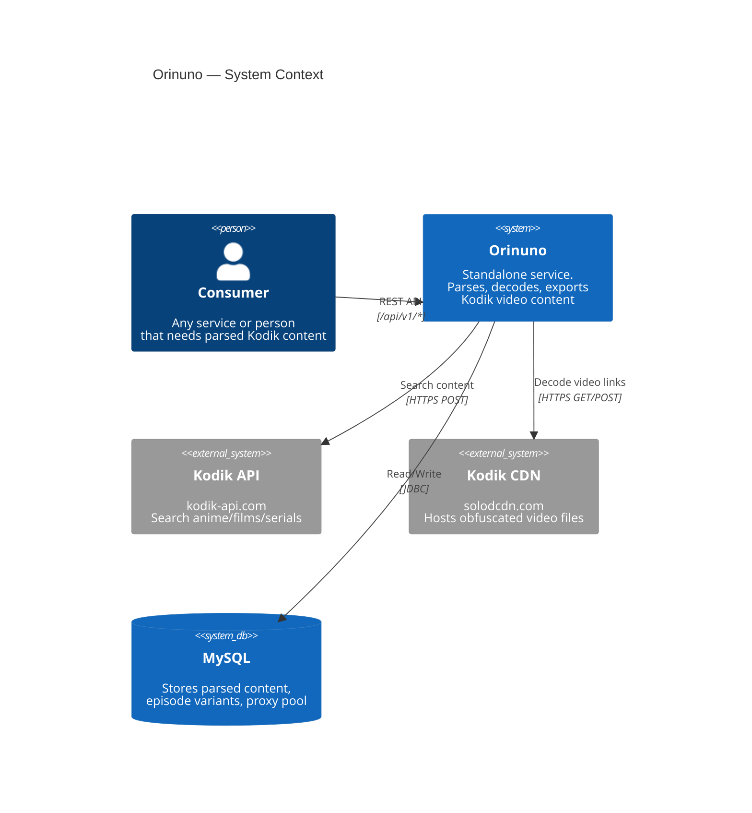
```mermaid
C4Context
    title Orinuno — System Context

    Person(consumer, "Consumer", "Any service or person<br/>that needs parsed Kodik content")
    System(orinuno, "Orinuno", "Standalone service.<br/>Parses, decodes, exports<br/>Kodik video content")
    System_Ext(kodik_api, "Kodik API", "kodik-api.com<br/>Search anime/films/serials")
    System_Ext(kodik_cdn, "Kodik CDN", "solodcdn.com<br/>Hosts obfuscated video files")
    SystemDb(mysql, "MySQL", "Stores parsed content,<br/>episode variants, proxy pool")

    Rel(consumer, orinuno, "REST API", "/api/v1/*")
    Rel(orinuno, kodik_api, "Search content", "HTTPS POST")
    Rel(orinuno, kodik_cdn, "Decode video links", "HTTPS GET/POST")
    Rel(orinuno, mysql, "Read/Write", "JDBC")
```

---

## Component Diagram

```mermaid
graph TB
    subgraph Controllers
        PC[ParseController<br/>/api/v1/parse]
        PRC[ParseRequestController<br/>/api/v1/parse/requests]
        KLC[KodikListController<br/>/api/v1/kodik/list]
        CC[ContentController<br/>/api/v1/content]
        EC[ExportController<br/>/api/v1/export]
        HC[HealthController<br/>/api/v1/health]
        DLC[DownloadController<br/>/api/v1/download]
        SC[StreamController<br/>/api/v1/stream]
    end

    subgraph Services
        PS[ParserService]
        CS[ContentService]
        EDS[ExportDataService]
        KVDS[KodikVideoDecoderService]
        DHT[DecoderHealthTracker]
        PPS[ProxyProviderService]
        VDS[VideoDownloadService]
        PVF[PlaywrightVideoFetcher]
        PRS[ParseRequestService]
        PRQ[ParseRequestQueueService]
        RW[RequestWorker<br/>@Scheduled]
        KLP[KodikListProxyService]
    end

    subgraph Clients
        KAC[KodikApiClient]
        KPW[kodikPlayerWebClient]
        CDNWC[kodikCdnWebClient]
    end

    subgraph Playwright
        CHROMIUM[Headless Chromium]
    end

    subgraph Repositories
        CR[(ContentRepository)]
        EVR[(EpisodeVariantRepository)]
        PR[(ProxyRepository)]
        PRR[(ParseRequestRepository)]
    end

    subgraph External
        KAPI[kodik-api.com]
        KCDN[Kodik CDN<br/>solodcdn.com]
        DB[(MySQL)]
    end

    subgraph Storage
        FS[Local FS<br/>./data/videos/]
    end

    PC --> PS
    PRC --> PRS
    KLC --> KLP
    CC --> CS
    EC --> EDS
    HC --> DHT
    HC --> PPS
    DLC --> VDS
    SC --> VDS
    SC --> PVF

    PRS --> PRR
    PRQ --> PRR
    RW --> PRQ
    RW --> PRS
    RW --> PS
    KLP --> KAC

    PS --> KAC
    PS --> CS
    PS --> KVDS
    PS --> EVR

    CS --> CR
    CS --> EVR
    EDS --> CR
    EDS --> EVR

    VDS --> PVF
    VDS --> KVDS
    VDS --> CDNWC
    VDS --> EVR
    VDS --> FS

    PVF --> CHROMIUM
    CHROMIUM --> KCDN

    KVDS --> KPW
    KVDS --> DHT
    PPS --> PR

    KAC --> KAPI
    KPW --> KCDN
    CDNWC --> KCDN

    CR --> DB
    EVR --> DB
    PR --> DB
    PRR --> DB

    style PC fill:#4a9eff,color:#fff
    style CC fill:#4a9eff,color:#fff
    style EC fill:#4a9eff,color:#fff
    style HC fill:#4a9eff,color:#fff
    style DLC fill:#4a9eff,color:#fff
    style SC fill:#4a9eff,color:#fff
    style PS fill:#ff9f43,color:#fff
    style CS fill:#ff9f43,color:#fff
    style EDS fill:#ff9f43,color:#fff
    style VDS fill:#ff9f43,color:#fff
    style KVDS fill:#ff6b6b,color:#fff
    style PVF fill:#e74c3c,color:#fff
    style CHROMIUM fill:#f39c12,color:#fff
    style FS fill:#d4ac0d,color:#fff
    style DB fill:#2ecc71,color:#fff
```

---

## Sequence Diagrams (PlantUML)

PlantUML `.puml` files are in the `docs/` directory. Render them at [plantuml.com/plantuml](https://www.plantuml.com/plantuml/uml) or with any IDE PlantUML plugin.

### 0. Container overview (C4)

High-level map: consumer, orinuno containers (API / parser / decoder / HLS / proxy layer / DB / filesystem), external systems (Kodik API / Player / CDN).

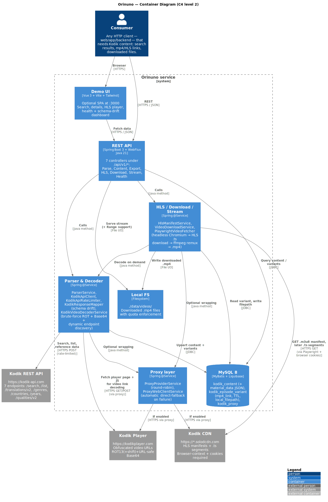

> Source: [docs/0_architecture_overview.puml](docs/0_architecture_overview.puml)

---

### 1. Kodik API flow

Работа с Kodik REST API — rate limiter (token-bucket `Semaphore`), raw-response-first (`Map<String, Object>`), schema drift detection (`KodikResponseMapper`), upsert в MySQL. Покрывает все 7 endpoint'ов: `/search`, `/list`, `/translations/v2`, `/genres`, `/countries`, `/years`, `/qualities/v2`.

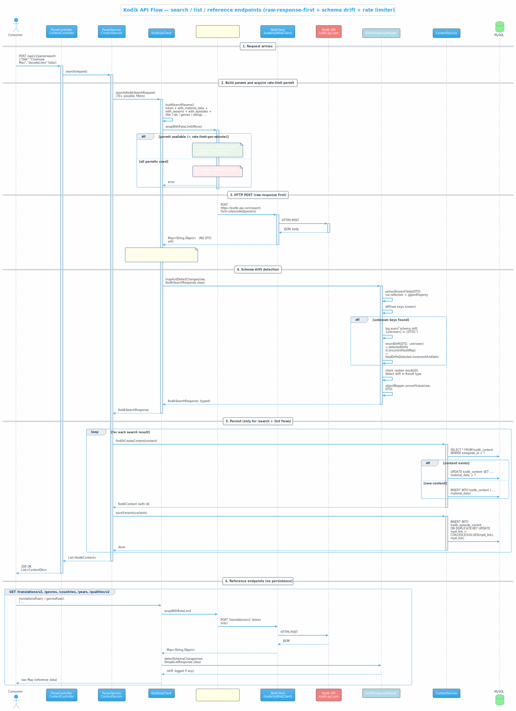

> Source: [docs/1_kodik_api_flow.puml](docs/1_kodik_api_flow.puml)

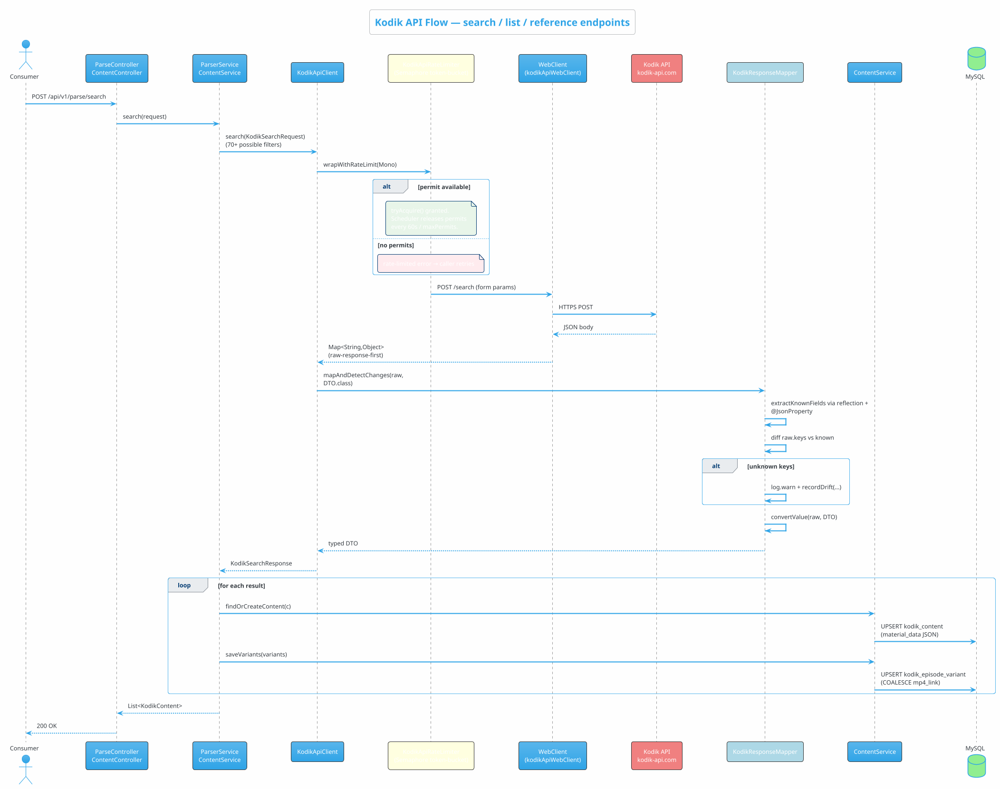
```plantuml
@startuml kodik_api_flow
!theme cerulean
skinparam backgroundColor #FEFEFE
skinparam sequenceArrowThickness 2
skinparam participantBorderColor #333
skinparam sequenceLifeLineBorderColor #999
skinparam maxMessageSize 200

title Kodik API Flow — search / list / reference endpoints

actor Consumer
participant "ParseController\nContentController" as PC
participant "ParserService\nContentService" as PS
participant "KodikApiClient" as KAC
participant "KodikApiRateLimiter\n(Semaphore token-bucket)" as RL #LightYellow
participant "WebClient\n(kodikApiWebClient)" as WC
participant "Kodik API\nkodik-api.com" as KAPI #LightCoral
participant "KodikResponseMapper" as KRM #LightBlue
participant "ContentService" as CS
database "MySQL" as DB #LightGreen

Consumer -> PC : POST /api/v1/parse/search
PC -> PS : search(request)
PS -> KAC : search(KodikSearchRequest)\n(70+ possible filters)
KAC -> RL : wrapWithRateLimit(Mono)
alt permit available
    note over RL #E8F5E9 : tryAcquire() granted.\nScheduler releases permits\nevery 60s / maxPermits.
else no permits
    note over RL #FFEBEE : rate-limited error → caller retries
end
RL -> WC : POST /search (form params)
WC -> KAPI : HTTPS POST
KAPI --> WC : JSON body
WC --> KAC : Map<String,Object>  (raw-response-first)
KAC -> KRM : mapAndDetectChanges(raw, DTO.class)
KRM -> KRM : extractKnownFields via reflection +\n@JsonProperty
KRM -> KRM : diff raw.keys vs known
alt unknown keys
    KRM -> KRM : log.warn + recordDrift(...)
end
KRM -> KRM : convertValue(raw, DTO)
KRM --> KAC : typed DTO
KAC --> PS : KodikSearchResponse
loop for each result
    PS -> CS : findOrCreateContent(c)
    CS -> DB : UPSERT kodik_content\n(material_data JSON)
    PS -> CS : saveVariants(variants)
    CS -> DB : UPSERT kodik_episode_variant\n(COALESCE mp4_link)
end
PS --> PC : List<KodikContent>
PC --> Consumer : 200 OK
@enduml
```

### 2. Video Link Decoding (8-step process)

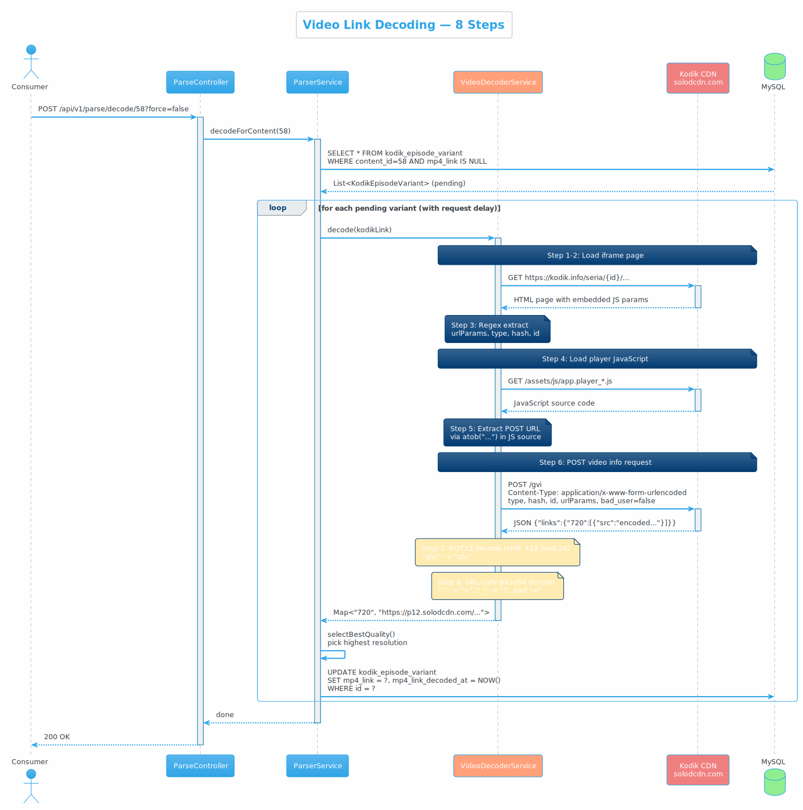

> Source: [docs/2_video_decoding.puml](docs/2_video_decoding.puml)

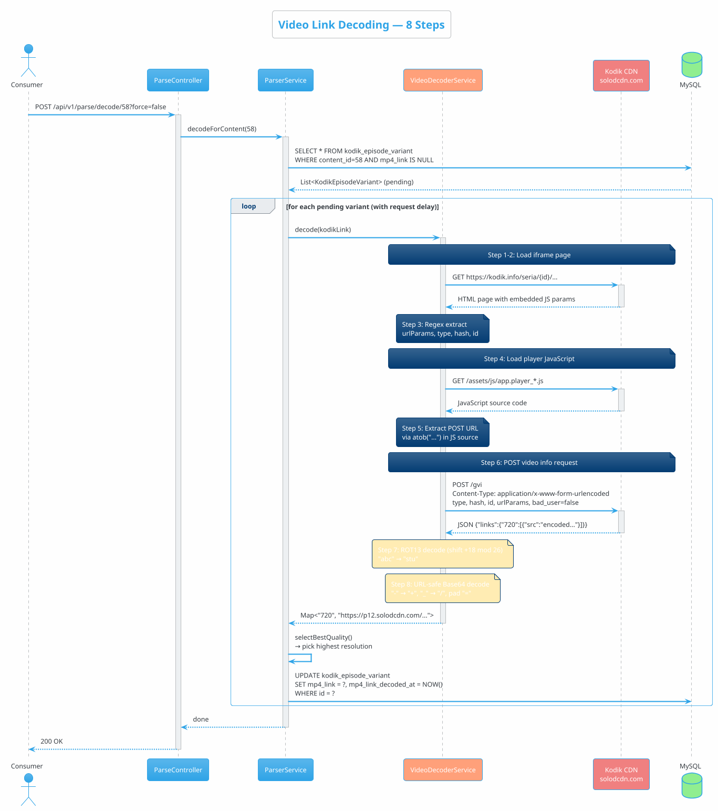
```plantuml
@startuml video_decoding
!theme cerulean
skinparam backgroundColor #FEFEFE
skinparam sequenceArrowThickness 2

title Video Link Decoding — 8 Steps

actor Consumer
participant "ParseController" as PC
participant "ParserService" as PS
participant "VideoDecoderService" as KVDS #LightSalmon
participant "Kodik CDN\nsolodcdn.com" as CDN #LightCoral
database "MySQL" as DB #LightGreen

Consumer -> PC : POST /api/v1/parse/decode/58?force=false
activate PC

PC -> PS : decodeForContent(58)
activate PS

PS -> DB : SELECT * FROM kodik_episode_variant\nWHERE content_id=58 AND mp4_link IS NULL
DB --> PS : List<KodikEpisodeVariant> (pending)

loop for each pending variant (with request delay)
    PS -> KVDS : decode(kodikLink)
    activate KVDS

    note over KVDS, CDN : Step 1–2: Load iframe page
    KVDS -> CDN : GET https://kodik.info/seria/{id}/...
    activate CDN
    CDN --> KVDS : HTML page with embedded JS params
    deactivate CDN

    note over KVDS : Step 3: Regex extract\nurlParams, type, hash, id

    note over KVDS, CDN : Step 4: Load player JavaScript
    KVDS -> CDN : GET /assets/js/app.player_*.js
    activate CDN
    CDN --> KVDS : JavaScript source code
    deactivate CDN

    note over KVDS : Step 5: Extract POST URL\nvia atob("...") in JS source

    note over KVDS, CDN : Step 6: POST video info request
    KVDS -> CDN : POST /gvi\nContent-Type: application/x-www-form-urlencoded\ntype, hash, id, urlParams, bad_user=false
    activate CDN
    CDN --> KVDS : JSON {"links":{"720":[{"src":"encoded..."}]}}
    deactivate CDN

    note over KVDS #FFECB3 : Step 7: ROT13 decode (shift +18 mod 26)\n"abc" → "stu"

    note over KVDS #FFECB3 : Step 8: URL-safe Base64 decode\n"-" → "+", "_" → "/", pad "="

    KVDS --> PS : Map<"720", "https://p12.solodcdn.com/...">
    deactivate KVDS

    PS -> PS : selectBestQuality()\n→ pick highest resolution

    PS -> DB : UPDATE kodik_episode_variant\nSET mp4_link = ?, mp4_link_decoded_at = NOW()\nWHERE id = ?
end

PS --> PC : done
deactivate PS

PC --> Consumer : 200 OK
deactivate PC
@enduml
```

### 3. Export Flow

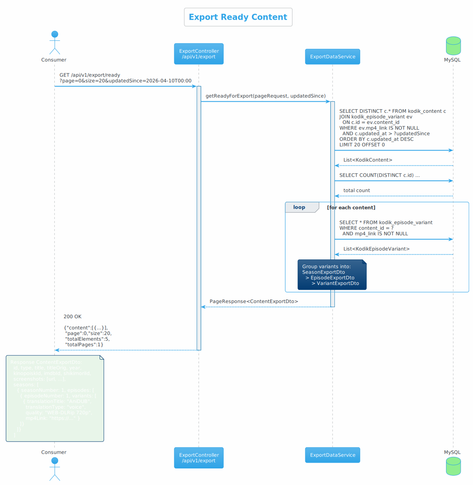

> Source: [docs/3_export_flow.puml](docs/3_export_flow.puml)

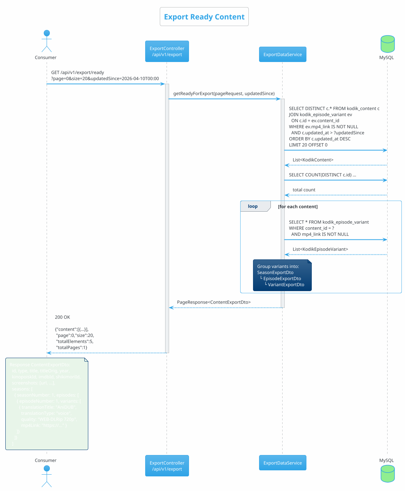
```plantuml
@startuml export_flow
!theme cerulean
skinparam backgroundColor #FEFEFE
skinparam sequenceArrowThickness 2

title Export Ready Content

actor Consumer
participant "ExportController\n/api/v1/export" as EC
participant "ExportDataService" as EDS
database "MySQL" as DB #LightGreen

Consumer -> EC : GET /api/v1/export/ready\n?page=0&size=20&updatedSince=2026-04-10T00:00
activate EC

EC -> EDS : getReadyForExport(pageRequest, updatedSince)
activate EDS

EDS -> DB : SELECT DISTINCT c.* FROM kodik_content c\nJOIN kodik_episode_variant ev\n  ON c.id = ev.content_id\nWHERE ev.mp4_link IS NOT NULL\n  AND c.updated_at > ?updatedSince\nORDER BY c.updated_at DESC\nLIMIT 20 OFFSET 0
DB --> EDS : List<KodikContent>

EDS -> DB : SELECT COUNT(DISTINCT c.id) ...
DB --> EDS : total count

loop for each content
    EDS -> DB : SELECT * FROM kodik_episode_variant\nWHERE content_id = ?\n  AND mp4_link IS NOT NULL
    DB --> EDS : List<KodikEpisodeVariant>

    note over EDS : Group variants into:\nSeasonExportDto\n  └ EpisodeExportDto\n      └ VariantExportDto
end

EDS --> EC : PageResponse<ContentExportDto>
deactivate EDS

EC --> Consumer : 200 OK\n\n{"content":[{...}],\n "page":0,"size":20,\n "totalElements":5,\n "totalPages":1}
deactivate EC

note over Consumer #E8F5E9
Response ContentExportDto:
  id, type, title, titleOrig, year,
  kinopoiskId, imdbId, shikimoriId,
  screenshots: [url, ...],
  seasons: [
    { seasonNumber: 1, episodes: [
      { episodeNumber: 1, variants: [
        { translationTitle: "AniDUB",
          translationType: "voice",
          quality: "WEB-DLRip 720p",
          mp4Link: "https://..." }
      ]}
    ]}
  ]
end note
@enduml
```

### 4. TTL Refresh & Retry (Background)

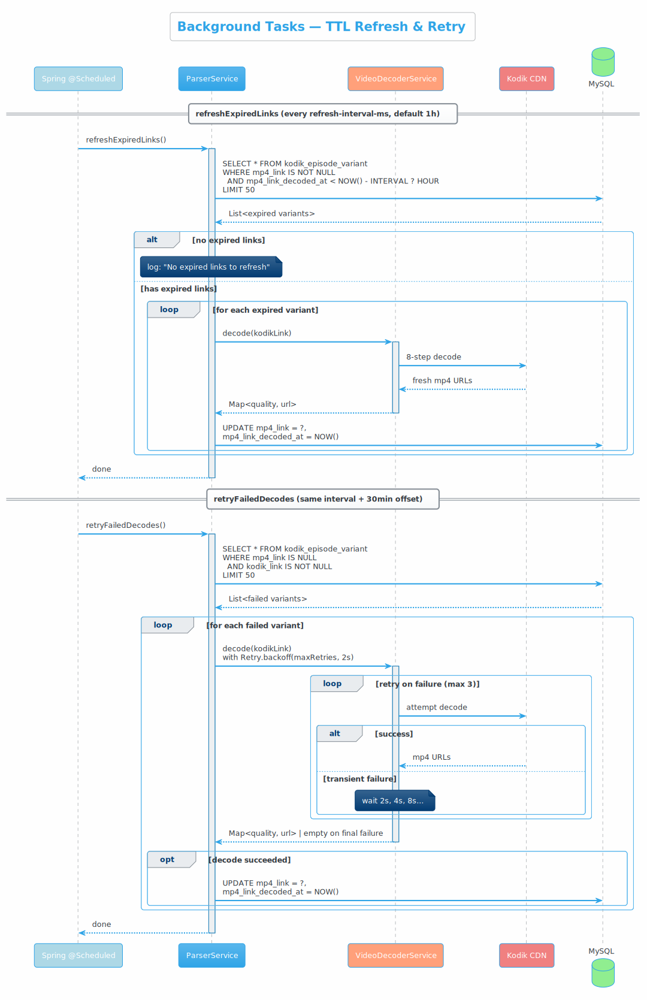

> Source: [docs/4_ttl_refresh.puml](docs/4_ttl_refresh.puml)

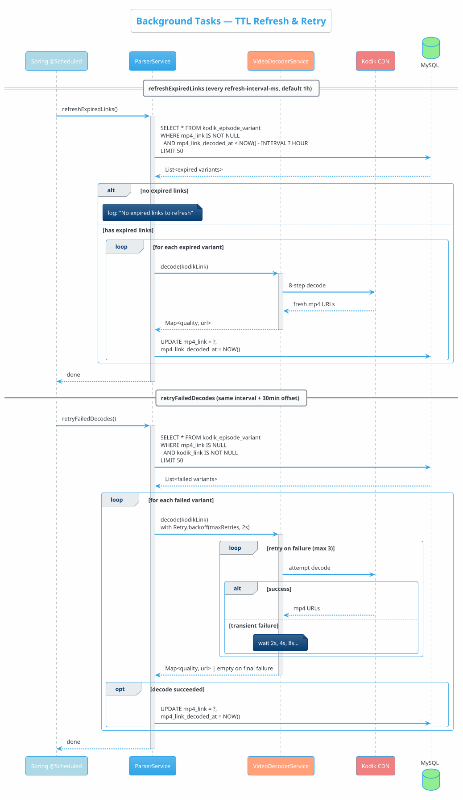
```plantuml
@startuml ttl_refresh
!theme cerulean
skinparam backgroundColor #FEFEFE
skinparam sequenceArrowThickness 2

title Background Tasks — TTL Refresh & Retry

participant "Spring @Scheduled" as SCH #LightBlue
participant "ParserService" as PS
participant "VideoDecoderService" as KVDS #LightSalmon
participant "Kodik CDN" as CDN #LightCoral
database "MySQL" as DB #LightGreen

== refreshExpiredLinks (every refresh-interval-ms, default 1h) ==

SCH -> PS : refreshExpiredLinks()
activate PS

PS -> DB : SELECT * FROM kodik_episode_variant\nWHERE mp4_link IS NOT NULL\n  AND mp4_link_decoded_at < NOW() - INTERVAL ? HOUR\nLIMIT 50
DB --> PS : List<expired variants>

alt no expired links
    note over PS : log: "No expired links to refresh"
else has expired links
    loop for each expired variant
        PS -> KVDS : decode(kodikLink)
        activate KVDS
        KVDS -> CDN : 8-step decode
        CDN --> KVDS : fresh mp4 URLs
        KVDS --> PS : Map<quality, url>
        deactivate KVDS

        PS -> DB : UPDATE mp4_link = ?,\nmp4_link_decoded_at = NOW()
    end
end

PS --> SCH : done
deactivate PS

== retryFailedDecodes (same interval + 30min offset) ==

SCH -> PS : retryFailedDecodes()
activate PS

PS -> DB : SELECT * FROM kodik_episode_variant\nWHERE mp4_link IS NULL\n  AND kodik_link IS NOT NULL\nLIMIT 50
DB --> PS : List<failed variants>

loop for each failed variant
    PS -> KVDS : decode(kodikLink)\nwith Retry.backoff(maxRetries, 2s)
    activate KVDS

    loop retry on failure (max 3)
        KVDS -> CDN : attempt decode
        alt success
            CDN --> KVDS : mp4 URLs
        else transient failure
            note over KVDS : wait 2s, 4s, 8s...
        end
    end

    KVDS --> PS : Map<quality, url> | empty on final failure
    deactivate KVDS

    opt decode succeeded
        PS -> DB : UPDATE mp4_link = ?,\nmp4_link_decoded_at = NOW()
    end
end

PS --> SCH : done
deactivate PS
@enduml
```

### 5. HLS manifest retrieval

Поток получения расшифрованного m3u8: `GET /api/v1/hls/{variantId}/manifest` → fresh decode через [KodikVideoDecoderService](#2-video-link-decoding-8-step-process) → загрузка CDN-манифеста (через `ProxyWebClientService` с fallback) → абсолютизация относительных URL в плейлисте → возврат клиенту с `Content-Type: application/vnd.apple.mpegurl`.

Облегчённый вариант `GET /api/v1/hls/{variantId}/url` возвращает только финальный `.m3u8` URL без загрузки содержимого плейлиста — подходит для интеграции с внешним downloader'ом, умеющим ходить напрямую в CDN.

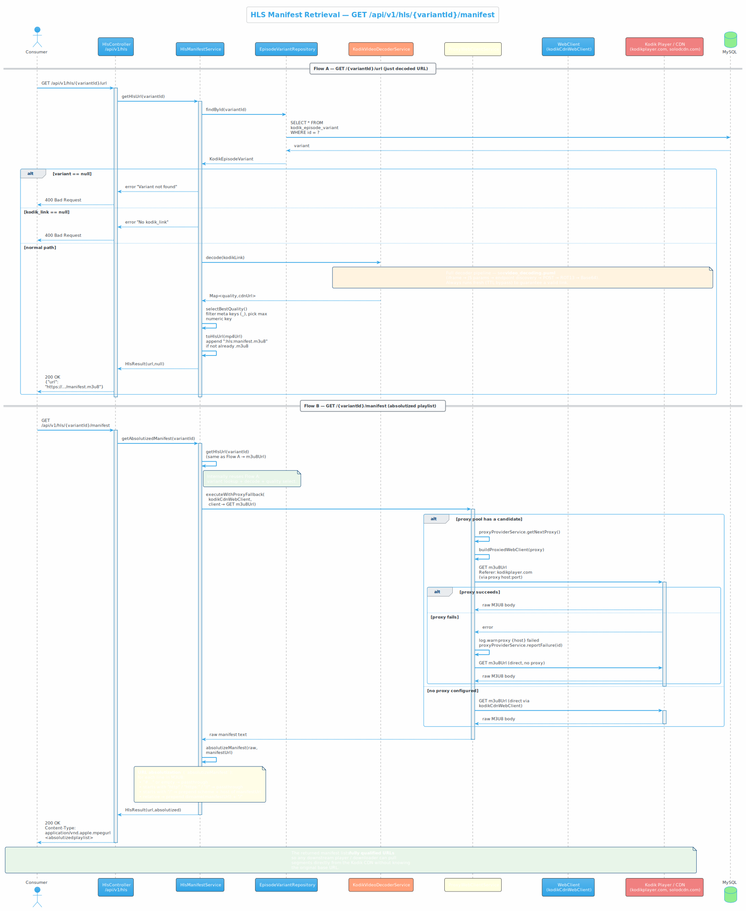

> Source: [docs/7_hls_manifest.puml](docs/7_hls_manifest.puml)

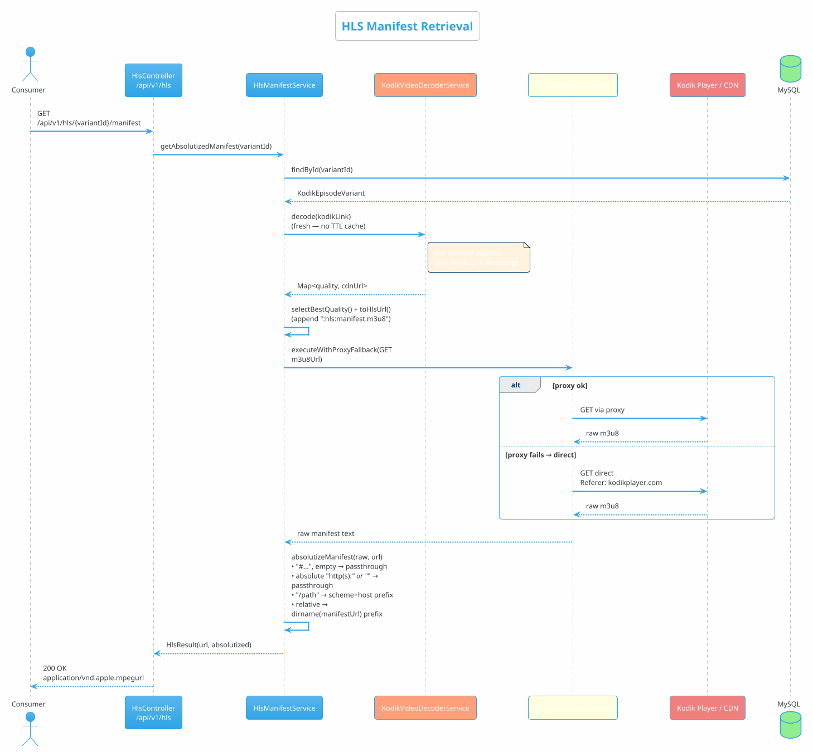
```plantuml
@startuml hls_manifest
!theme cerulean
skinparam backgroundColor #FEFEFE
skinparam sequenceArrowThickness 2
skinparam maxMessageSize 180

title HLS Manifest Retrieval

actor Consumer
participant "HlsController\n/api/v1/hls" as HC
participant "HlsManifestService" as HMS
participant "KodikVideoDecoderService" as KVDS #LightSalmon
participant "ProxyWebClientService" as PWS #LightYellow
participant "Kodik Player / CDN" as CDN #LightCoral
database "MySQL" as DB #LightGreen

Consumer -> HC : GET /api/v1/hls/{variantId}/manifest
HC -> HMS : getAbsolutizedManifest(variantId)
HMS -> DB : findById(variantId)
DB --> HMS : KodikEpisodeVariant
HMS -> KVDS : decode(kodikLink)\n(fresh — no TTL cache)
note right of KVDS #FFF3E0 : Full decoder pipeline\n(see Video Link Decoding)
KVDS --> HMS : Map<quality, cdnUrl>
HMS -> HMS : selectBestQuality() + toHlsUrl()\n(append ":hls:manifest.m3u8")
HMS -> PWS : executeWithProxyFallback(GET m3u8Url)
alt proxy ok
    PWS -> CDN : GET via proxy
    CDN --> PWS : raw m3u8
else proxy fails → direct
    PWS -> CDN : GET direct\nReferer: kodikplayer.com
    CDN --> PWS : raw m3u8
end
PWS --> HMS : raw manifest text
HMS -> HMS : absolutizeManifest(raw, url)\n• "#...", empty → passthrough\n• absolute "http(s)://" or "//" → passthrough\n• "/path" → scheme+host prefix\n• relative → dirname(manifestUrl) prefix
HMS --> HC : HlsResult(url, absolutized)
HC --> Consumer : 200 OK\napplication/vnd.apple.mpegurl
@enduml
```

### 6. Video Download via Playwright + HLS

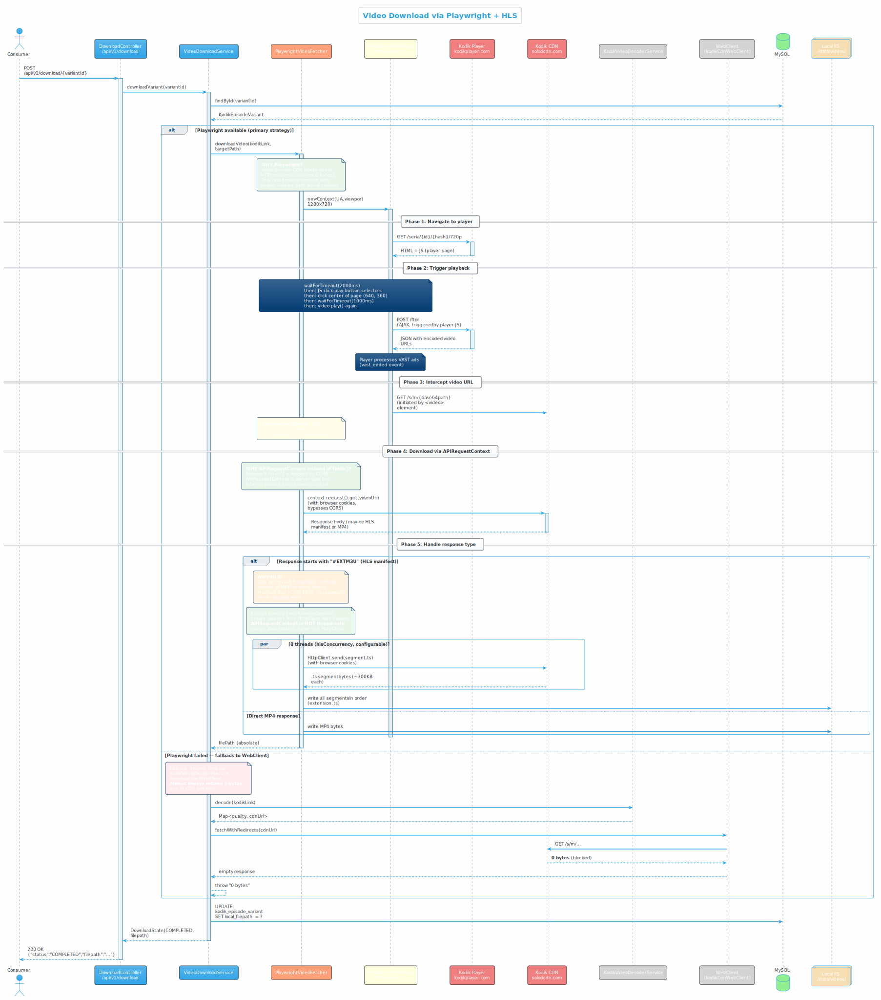

> Source: [docs/6_video_download_playwright.puml](docs/6_video_download_playwright.puml)

**Контекст проблемы:** CDN `solodcdn.com` исторически блокировал прямые HTTP-запросы к видеофайлам, возвращая HTTP 200 с `Content-Length: 0` для любых клиентов вне браузерного контекста. Сегодня поведение мягче — CDN принимает клиентов с корректным `User-Agent`, `Referer` и полной цепочкой редиректов. Поэтому `VideoDownloadService.downloadWithStrategy` пробует три стратегии по порядку приоритета:

1. **Fast-path (cached `mp4_link`):** если variant уже раскодирован и `mp4_link` начинается с `http`, идём сразу на CDN через `downloadFromCdn(...)` — без запуска Playwright. Типичное время до первого байта ≈ 2 сек. При 403/404 (истёкшая ссылка) автоматически откатываемся в Path 3.
2. **Playwright + HLS** (описано ниже): используется, когда `mp4_link` ещё не раскодирован. Скачивает сегменты параллельно — ≈9× быстрее, чем единичный MP4-стрим.
3. **WebClient direct MP4** (fallback): реактивный HTTP-клиент с `User-Agent`, `Referer` и ручным обходом редиректов через `fetchWithRedirects(...)`. `Content-Length` финального 2xx-ответа попадает в `DownloadProgress.expectedTotalBytes`, и каждый записанный `DataBuffer` инкрементирует `totalBytes`.

**Почему Playwright всё ещё нужен:** для контента, у которого `mp4_link` ещё не раскодирован, Playwright — единственный путь получить HLS-манифест с валидными cookies из `BrowserContext`. Java SDK (`com.microsoft.playwright`) официальный, в отличие от Puppeteer (только Node.js).

**Stealth shim:** `PlaywrightVideoFetcher.newStealthContext()` создаёт `BrowserContext` с реалистичным Chrome/135 UA, viewport 1280×720, локалью `en-US`, таймзоной `Europe/London` и init-скриптом, который патчит `navigator.webdriver`, `navigator.languages`, `navigator.plugins`, `window.chrome` и `Notification.permission`. Это обходит примитивные anti-bot проверки, но **не решает** IP-based geo-blocking — для этого нужна прокси-ротация (см. `BACKLOG.md → IDEA-DOWNLOAD-PROXY`).

**Geo-block sentinel:** когда Kodik блокирует плеер по IP, `parseVideoResponse` возвращает пустую мапу качеств (без sentinel-значений). Дополнительно `selectBestQuality`, `pickBestQualityUrl` и `StreamController.pickBestQuality` защитно отбрасывают ключи, начинающиеся с `_`, и значения, не начинающиеся с `http` — это гарантирует, что ни один sentinel не просочится в `mp4_link`. Liquibase-миграция `20260425010000_cleanup_invalid_mp4_link.sql` обнуляет пре-существующие битые записи вида `mp4_link='true'`.

**Алгоритм из 5 фаз (Playwright-путь):**

1. **Navigate** — headless Chromium загружает страницу Kodik-плеера (`/seria/{id}/{hash}/720p`). Страница включает JS плеера, метрику, рекламные скрипты.

2. **Trigger playback** — имитируем клик по кнопке Play через JS-селекторы (`.play_button`, `[class*="play"]`) и клик в центр viewport (640, 360). Плеер делает POST к `/ftor`, получает зашифрованные видео-URL, обрабатывает VAST рекламу, после чего инициирует загрузку видео.

3. **Intercept video URL** — `page.onResponse()` перехватывает запрос к `solodcdn.com/s/m/...`, который плеер делает для загрузки видео. Мы фиксируем URL, но **не пытаемся читать response.body()** — для большого файла это бесполезно (streaming).

4. **Download via APIRequestContext** — ключевой трюк. `context.request().get(videoUrl)` — это серверный HTTP-запрос Playwright, который **обходит CORS** (в отличие от `page.evaluate(fetch(...))`, который блокируется), но при этом **наследует cookies** из `BrowserContext`. CDN видит валидные cookies и отдаёт контент.

5. **Handle HLS (parallel) + Remux** — CDN часто отдаёт не MP4, а HLS-манифест (`.m3u8`). Алгоритм определяет это по заголовку `#EXTM3U`, парсит список `.ts`-сегментов (~200-1300 штук). Далее из `BrowserContext` извлекаются cookies (`context.cookies()`), и сегменты скачиваются **параллельно** через `java.net.http.HttpClient` (по умолчанию 8 потоков, настраивается `hlsConcurrency`). Playwright `APIRequestContext` не используется для сегментов, т.к. он не потокобезопасен (одиночный WebSocket). Сегменты хранятся в `byte[][]` и записываются на диск строго по порядку, затем файл **автоматически ремуксится** из `.ts` в `.mp4` через `ffmpeg -c copy -movflags +faststart` (без перекодирования — операция мгновенная). Это необходимо, т.к. браузерный `<video>` не умеет воспроизводить MPEG-TS, а MP4 поддерживается везде.

**Прогресс-трекинг:** `VideoDownloadService` поддерживает in-memory `DownloadProgress` с атомарными счётчиками `totalSegments` / `downloadedSegments` (Playwright HLS-путь), `totalBytes` (оба пути) и `expectedTotalBytes` (WebClient-путь, из `Content-Length`). POST `/api/v1/download/{id}` возвращает `IN_PROGRESS` немедленно, GET `/api/v1/download/{id}/status` поллит прогресс. Demo UI выбирает один из трёх режимов отображения: **segments** (HLS), **bytes** (WebClient), **indeterminate** (с подсказкой-phase hint и таймером elapsed).

**Стриминг:** `StreamController` (GET `/api/v1/stream/{id}`) отдаёт локальный файл с поддержкой Range-запросов, или инициирует download-on-demand через Playwright.

**Fallback:** если Playwright недоступен или упал — используется Path 3 через `KodikVideoDecoderService` + `WebClient` + `fetchWithRedirects`. При валидном `User-Agent` и следовании цепочке редиректов CDN отдаёт реальные байты; прогресс по-прежнему виден через `expectedTotalBytes` / `totalBytes`.

**Критические зависимости:**
- `com.microsoft.playwright:playwright:1.58.0` (Java SDK)
- Chromium (устанавливается автоматически при первом запуске или через `playwright install chromium`)
- `ffmpeg` — для remux `.ts` → `.mp4` (stream copy, без перекодирования)
- В Docker: нужны системные пакеты для headless Chromium (`--with-deps`) и ffmpeg

**Конфигурация** (`orinuno.playwright.*`):
- `enabled` — включить/выключить (default: `true`)
- `headless` — headless режим (default: `true`)
- `page-timeout-seconds` — общий таймаут операций страницы (default: `30`)
- `navigation-timeout-ms` — таймаут навигации (default: `15000`)
- `video-wait-ms` — макс. ожидание появления видео-URL (default: `20000`)
- `hls-concurrency` — кол-во параллельных потоков для скачивания HLS-сегментов (default: `16`)

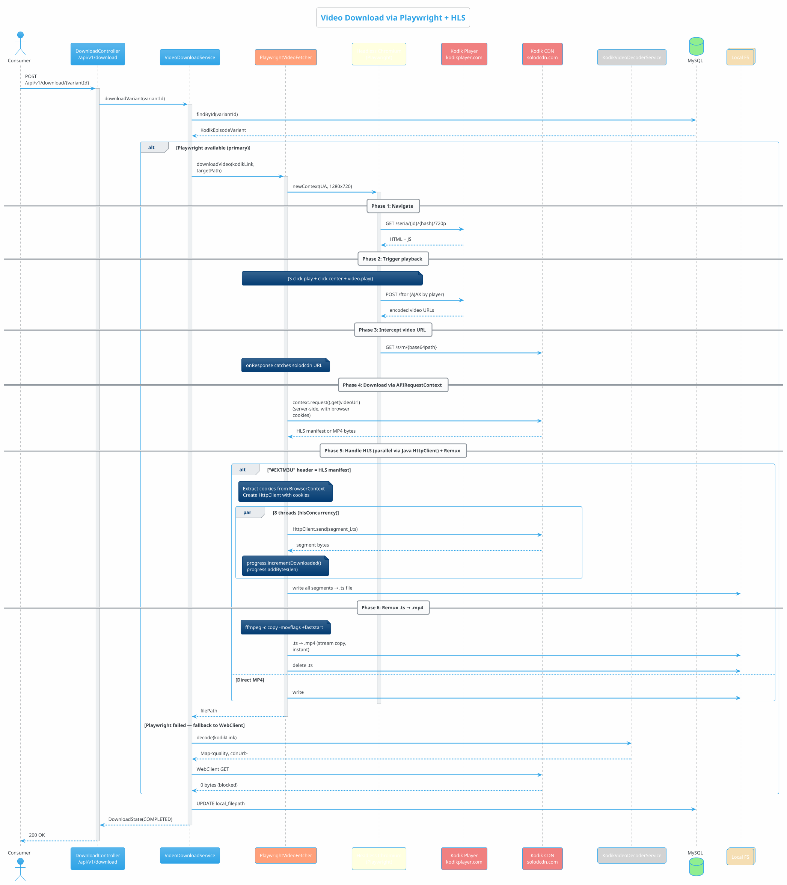
```plantuml
@startuml video_download_playwright
!theme cerulean
skinparam backgroundColor #FEFEFE
skinparam sequenceArrowThickness 2
skinparam maxMessageSize 180

title Video Download via Playwright + HLS

actor Consumer
participant "DownloadController\n/api/v1/download" as DC
participant "VideoDownloadService" as VDS
participant "PlaywrightVideoFetcher" as PVF #LightSalmon
participant "Headless Chromium\n(Playwright)" as CHROME #LightYellow
participant "Kodik Player\nkodikplayer.com" as KP #LightCoral
participant "Kodik CDN\nsolodcdn.com" as CDN #LightCoral
participant "KodikVideoDecoderService" as KVDS #LightGray
database "MySQL" as DB #LightGreen
collections "Local FS" as FS #Wheat

Consumer -> DC : POST /api/v1/download/{variantId}
activate DC

DC -> VDS : downloadVariant(variantId)
activate VDS

VDS -> DB : findById(variantId)
DB --> VDS : KodikEpisodeVariant

alt Playwright available (primary)

    VDS -> PVF : downloadVideo(kodikLink, targetPath)
    activate PVF

    PVF -> CHROME : newContext(UA, 1280x720)
    activate CHROME

    == Phase 1: Navigate ==
    CHROME -> KP : GET /seria/{id}/{hash}/720p
    KP --> CHROME : HTML + JS

    == Phase 2: Trigger playback ==
    note over PVF, CHROME : JS click play + click center + video.play()
    CHROME -> KP : POST /ftor (AJAX by player)
    KP --> CHROME : encoded video URLs

    == Phase 3: Intercept video URL ==
    CHROME -> CDN : GET /s/m/{base64path}
    note over PVF : onResponse catches solodcdn URL

    == Phase 4: Download via APIRequestContext ==
    PVF -> CDN : context.request().get(videoUrl)\n(server-side, with browser cookies)
    CDN --> PVF : HLS manifest or MP4 bytes

    == Phase 5: Handle HLS (parallel via Java HttpClient) + Remux ==
    alt "#EXTM3U" header = HLS manifest
        note over PVF : Extract cookies from BrowserContext\nCreate HttpClient with cookies
        par 8 threads (hlsConcurrency)
            PVF -> CDN : HttpClient.send(segment_i.ts)
            CDN --> PVF : segment bytes
            note over PVF : progress.incrementDownloaded()\nprogress.addBytes(len)
        end
        PVF -> FS : write all segments → .ts file

        == Phase 6: Remux .ts → .mp4 ==
        note over PVF : ffmpeg -c copy -movflags +faststart
        PVF -> FS : .ts → .mp4 (stream copy, instant)
        PVF -> FS : delete .ts
    else Direct MP4
        PVF -> FS : write
    end

    deactivate CHROME
    PVF --> VDS : filePath
    deactivate PVF

else Playwright failed — fallback to WebClient
    VDS -> KVDS : decode(kodikLink)
    KVDS --> VDS : Map<quality, cdnUrl>
    VDS -> CDN : WebClient GET
    CDN --> VDS : 0 bytes (blocked)
end

VDS -> DB : UPDATE local_filepath
VDS --> DC : DownloadState(COMPLETED)
deactivate VDS

DC --> Consumer : 200 OK
deactivate DC
@enduml
```

---

**Почему другие подходы не работают (журнал исследования):**

| Подход | Результат | Причина |
|--------|-----------|---------|
| WebClient + Referer/UA | 0 bytes | CDN проверяет не только заголовки, а целый браузерный контекст |
| WebClient + followRedirect(false) + ручные редиректы | 0 bytes | 302 проходит, но финальный ответ пустой |
| WebClient + single-pass exchangeToFlux | 0 bytes | CDN блокирует на уровне TLS/fingerprint |
| Playwright + response.body() | Timeout | Видео слишком большое, body() ждёт полной загрузки |
| Playwright + page.evaluate(fetch()) | CORS error | fetch() API в браузере заблокирован CORS для cross-origin CDN |
| **Playwright + APIRequestContext** | **Работает** | Серверный запрос Playwright с cookies из BrowserContext |
| Playwright APIRequestContext + многопоточность | Ошибки "Object doesn't exist" | APIRequestContext не потокобезопасен (один WebSocket) |
| **Playwright cookies + Java HttpClient (parallel)** | **Работает, быстро** | Cookies из BrowserContext + нативный параллелизм HttpClient |
| **+ ffmpeg remux (.ts → .mp4)** | **Финальный шаг** | Браузерный `<video>` не играет MPEG-TS; stream copy + faststart — мгновенно |

---

### 7. Async parse-request log

Phase 2 turns synchronous Kodik searches into a durable, idempotent
request log so `parser-kodik` discovery can fan out work without holding
HTTP connections open. The synchronous `POST /api/v1/parse/search`
remains for the demo site / human exploration; this flow is for
machine-driven discovery.

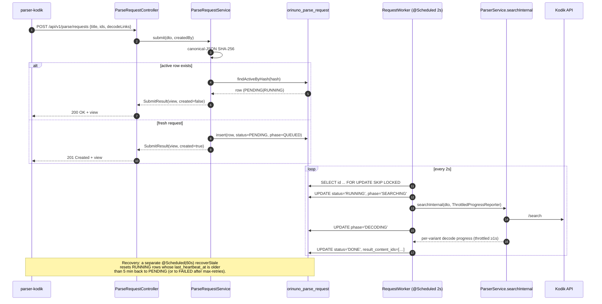
```mermaid
sequenceDiagram
    autonumber
    participant Client as parser-kodik
    participant API as ParseRequestController
    participant Service as ParseRequestService
    participant DB as orinuno_parse_request
    participant Worker as RequestWorker (@Scheduled 2s)
    participant Parser as ParserService.searchInternal
    participant Kodik as Kodik API

    Client->>API: POST /api/v1/parse/requests {title, ids, decodeLinks}
    API->>Service: submit(dto, createdBy)
    Service->>Service: canonical-JSON SHA-256
    alt active row exists
        Service->>DB: findActiveByHash(hash)
        DB-->>Service: row (PENDING|RUNNING)
        Service-->>API: SubmitResult(view, created=false)
        API-->>Client: 200 OK + view
    else fresh request
        Service->>DB: insert(row, status=PENDING, phase=QUEUED)
        Service-->>API: SubmitResult(view, created=true)
        API-->>Client: 201 Created + view
    end

    loop every 2s
        Worker->>DB: SELECT id ... FOR UPDATE SKIP LOCKED
        Worker->>DB: UPDATE status='RUNNING', phase='SEARCHING'
        Worker->>Parser: searchInternal(dto, ThrottledProgressReporter)
        Parser->>Kodik: /search
        Worker->>DB: UPDATE phase='DECODING'
        Parser-->>Worker: per-variant decode progress (throttled ≥1s)
        Worker->>DB: UPDATE status='DONE', result_content_ids=[…]
    end

    Note over Client,DB: Recovery: a separate @Scheduled(60s) recoverStale<br/>resets RUNNING rows whose last_heartbeat_at is older<br/>than 5 min back to PENDING (or to FAILED after max-retries).
```

**Key invariants**

- **Idempotency** — submit returns the existing active row (200) instead of inserting on duplicates. Hash is computed over a canonical JSON form (sorted keys, normalized strings, null fields stripped).
- **At-most-one worker per row** — `SELECT … FOR UPDATE SKIP LOCKED` plus the explicit `markClaimed` update inside `ParseRequestQueueService.@Transactional`. The queue service is a separate Spring bean specifically so that `@Transactional` is honoured (Spring's proxy is bypassed on intra-class self-invocation, hence the split from `RequestWorker`).
- **Heartbeats, not timeouts** — `ThrottledProgressReporter` updates `last_heartbeat_at` on every flush; `recoverStale` uses that column instead of wall-clock duration.
- **No-polling for parser-kodik** — discovery treats `GET /api/v1/export/ready?updatedSince=…` as the completion signal. The list endpoint is allowed only with `?status=PENDING&limit=0` to read `X-Total-Count` for backpressure.

See [`docs-site/architecture/parse-requests`](docs-site/src/content/docs/architecture/parse-requests.md) for the full SLA table, configuration knobs and the no-polling rationale.

---

## Entity Relationship Diagram

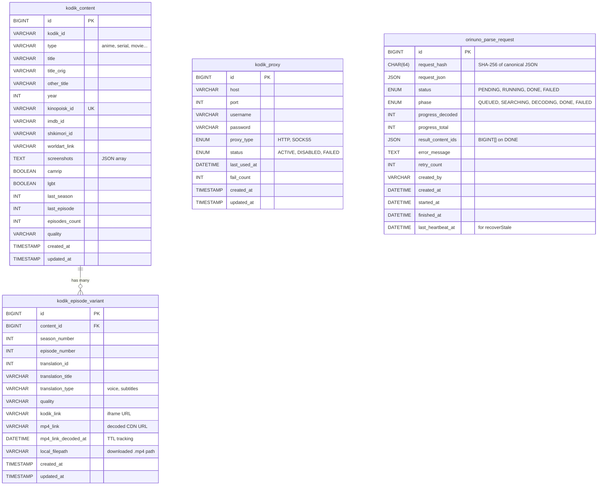
```mermaid
erDiagram
    kodik_content {
        BIGINT id PK
        VARCHAR kodik_id
        VARCHAR type "anime, serial, movie..."
        VARCHAR title
        VARCHAR title_orig
        VARCHAR other_title
        INT year
        VARCHAR kinopoisk_id UK
        VARCHAR imdb_id
        VARCHAR shikimori_id
        VARCHAR worldart_link
        TEXT screenshots "JSON array"
        BOOLEAN camrip
        BOOLEAN lgbt
        INT last_season
        INT last_episode
        INT episodes_count
        VARCHAR quality
        TIMESTAMP created_at
        TIMESTAMP updated_at
    }

    kodik_episode_variant {
        BIGINT id PK
        BIGINT content_id FK
        INT season_number
        INT episode_number
        INT translation_id
        VARCHAR translation_title
        VARCHAR translation_type "voice, subtitles"
        VARCHAR quality
        VARCHAR kodik_link "iframe URL"
        VARCHAR mp4_link "decoded CDN URL"
        DATETIME mp4_link_decoded_at "TTL tracking"
        VARCHAR local_filepath "downloaded .mp4 path"
        TIMESTAMP created_at
        TIMESTAMP updated_at
    }

    kodik_proxy {
        BIGINT id PK
        VARCHAR host
        INT port
        VARCHAR username
        VARCHAR password
        ENUM proxy_type "HTTP, SOCKS5"
        ENUM status "ACTIVE, DISABLED, FAILED"
        DATETIME last_used_at
        INT fail_count
        TIMESTAMP created_at
        TIMESTAMP updated_at
    }

    orinuno_parse_request {
        BIGINT id PK
        CHAR(64) request_hash "SHA-256 of canonical JSON"
        JSON request_json
        ENUM status "PENDING, RUNNING, DONE, FAILED"
        ENUM phase "QUEUED, SEARCHING, DECODING, DONE, FAILED"
        INT progress_decoded
        INT progress_total
        JSON result_content_ids "BIGINT[] on DONE"
        TEXT error_message
        INT retry_count
        VARCHAR created_by
        DATETIME created_at
        DATETIME started_at
        DATETIME finished_at
        DATETIME last_heartbeat_at "for recoverStale"
    }

    kodik_content ||--o{ kodik_episode_variant : "has many"
```

---

## Video URL Decoding Pipeline


```mermaid
flowchart LR
    A["Kodik iframe URL<br/>//kodik.info/seria/..."] --> B["Load iframe HTML"]
    B --> C["Extract JS params<br/>urlParams, type, hash, id"]
    C --> D["Load player JS<br/>app.player_*.js"]
    D --> E["Extract POST URL<br/>atob('...')"]
    E --> F["POST /gvi<br/>with form data"]
    F --> G["Encoded video URLs<br/>in JSON response"]
    G --> H["ROT13 decode<br/>(shift +18 mod 26)"]
    H --> I["Base64 decode<br/>(URL-safe)"]
    I --> J["Direct MP4 URL<br/>https://p12.solodcdn.com/..."]

    style A fill:#e74c3c,color:#fff
    style J fill:#2ecc71,color:#fff
    style H fill:#f39c12,color:#fff
    style I fill:#f39c12,color:#fff
```

---

## Integration Guide

### Consumer polling pattern

Общий шаблон для сервиса-потребителя (catalog importer, CDN mirror, и т.п.), который периодически забирает готовый к экспорту контент из Orinuno:

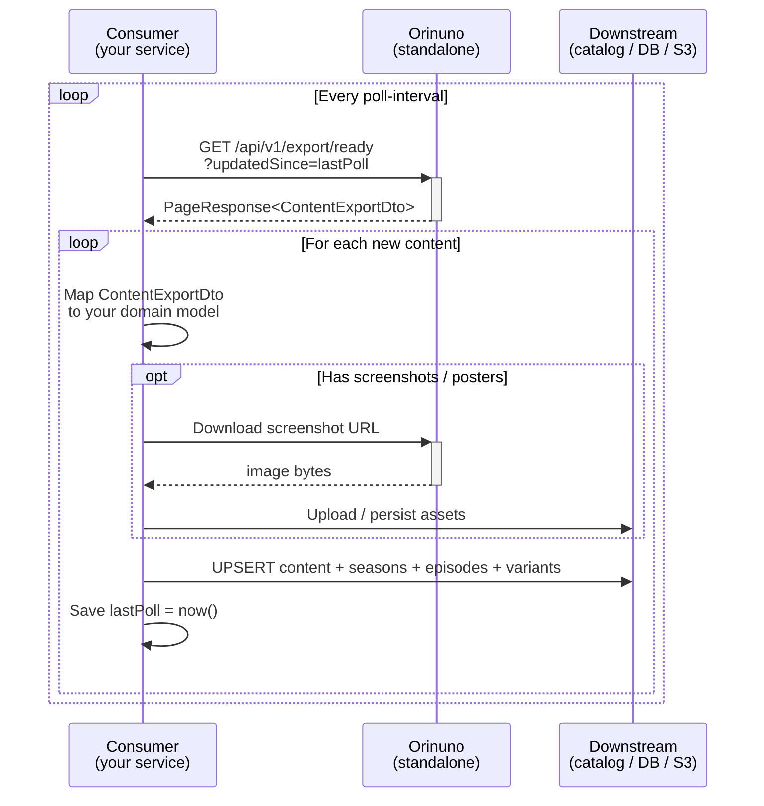
```mermaid
sequenceDiagram
    participant C as Consumer<br/>(your service)
    participant SK as Orinuno<br/>(standalone)
    participant STORE as Downstream<br/>(catalog / DB / S3)

    loop Every poll-interval
        C->>+SK: GET /api/v1/export/ready<br/>?updatedSince=lastPoll
        SK-->>-C: PageResponse<ContentExportDto>

        loop For each new content
            C->>C: Map ContentExportDto<br/>to your domain model

            opt Has screenshots / posters
                C->>+SK: Download screenshot URL
                SK-->>-C: image bytes
                C->>STORE: Upload / persist assets
            end

            C->>STORE: UPSERT content + seasons + episodes + variants

            C->>C: Save lastPoll = now()
        end
    end
```

Ключевые идеи:

1. **Инкрементальный poll** — фильтр `updatedSince` возвращает только записи, обновлённые с момента последнего поллинга.
2. **Идемпотентность** — на своей стороне ведите состояние «экспортировано / ошибка» по `kinopoisk_id` или `orinuno_content_id`, чтобы переигровка не создавала дубли.
3. **Отдельное хранилище ассетов** — mp4/скриншоты/постеры лучше складывать в отдельное хранилище (S3/MinIO/CDN), а не гонять напрямую с Kodik CDN каждый раз — ссылки TTL-ом стираются.

### Async submit pattern (parser-kodik discovery)

For machine-driven discovery (e.g. parser-kodik gap-filling missing
titles in meter-api), use the async parse-request log instead of the
synchronous `/parse/search`:

```bash
# 1. Backpressure — read pending queue depth without polling individual rows
curl -sI "http://localhost:8085/api/v1/parse/requests?status=PENDING&limit=0" \
  -H "X-API-KEY: $KEY" | grep -i x-total-count

# 2. Submit (idempotent — same payload twice returns 200, not 201)
curl -X POST "http://localhost:8085/api/v1/parse/requests" \
  -H "X-API-KEY: $KEY" \
  -H "Content-Type: application/json" \
  -d '{"shikimoriId":"42897","decodeLinks":true}'

# 3. Watch /export/ready for completion (NOT /parse/requests/{id})
curl "http://localhost:8085/api/v1/export/ready?updatedSince=2026-04-26T00:00:00Z" \
  -H "X-API-KEY: $KEY"
```

See [docs-site/architecture/parse-requests](docs-site/src/content/docs/architecture/parse-requests.md) for the full no-polling rule and SLA targets.

### Quick start for consumers

```bash
# 1. Start Orinuno
docker compose up -d

# 2. Search for content
curl -X POST http://localhost:8085/api/v1/parse/search \
  -H "Content-Type: application/json" \
  -d '{"title": "Chainsaw Man", "decodeLinks": true}'

# 3. Poll ready exports
curl "http://localhost:8085/api/v1/export/ready?page=0&size=10"

# 4. Get specific content export
curl "http://localhost:8085/api/v1/export/58"
```

### Export DTO structure

```json
{
  "id": 58,
  "type": "anime",
  "title": "Человек-бензопила",
  "titleOrig": "Chainsaw Man",
  "year": 2022,
  "kinopoiskId": "2040161",
  "imdbId": "tt13634480",
  "shikimoriId": "44511",
  "screenshots": ["https://i.kodikres.com/..."],
  "seasons": [
    {
      "seasonNumber": 1,
      "episodes": [
        {
          "episodeNumber": 1,
          "variants": [
            {
              "id": 4903,
              "translationId": 610,
              "translationTitle": "AniDUB",
              "translationType": "voice",
              "quality": "WEB-DLRip 720p",
              "mp4Link": "https://p12.solodcdn.com/s/m/..."
            }
          ]
        }
      ]
    }
  ]
}
```

---

## Configuration & Deployment

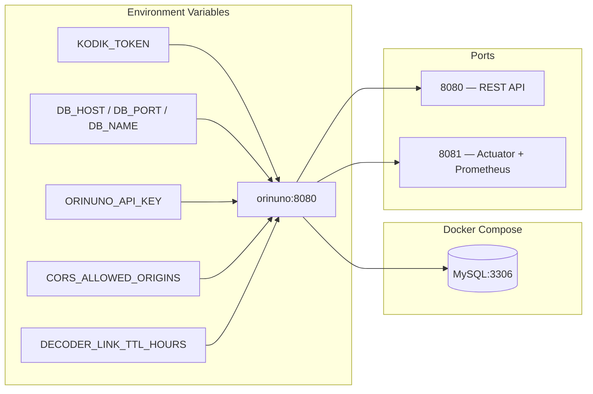
```mermaid
graph LR
    subgraph Environment Variables
        A[KODIK_TOKEN] --> App
        B[DB_HOST / DB_PORT / DB_NAME] --> App
        C[ORINUNO_API_KEY] --> App
        D[CORS_ALLOWED_ORIGINS] --> App
        E[DECODER_LINK_TTL_HOURS] --> App
    end

    subgraph Docker Compose
        App[orinuno:8080]
        MySQL[(MySQL:3306)]
    end

    App --> MySQL

    subgraph Ports
        P1[8080 — REST API]
        P2[8081 — Actuator + Prometheus]
    end

    App --> P1
    App --> P2
```

---

## Local rendering

SVG и PNG файлы в `docs/images/` создаются автоматически GitHub Action ([`.github/workflows/render-diagrams.yml`](.github/workflows/render-diagrams.yml)) при каждом push, который меняет `docs/*.puml`. Action использует [официальный Docker-образ `plantuml/plantuml`](https://hub.docker.com/r/plantuml/plantuml) и коммитит результат обратно в репозиторий от имени `github-actions[bot]`.

Чтобы отрендерить локально (нужен запущенный Docker):

```bash
cd /path/to/orinuno
mkdir -p docs/images
docker run --rm -v "$PWD/docs:/data" -w /data plantuml/plantuml:latest \
    -tsvg -o images '*.puml'

# Отдельно PNG (для вьюеров, не поддерживающих SVG):
docker run --rm -v "$PWD/docs:/data" -w /data plantuml/plantuml:latest \
    -tpng -o images '*.puml'
```

Альтернативы без Docker:
- PlantUML jar: `java -jar plantuml.jar -tsvg -o images docs/*.puml`
- IDE-плагины: IntelliJ IDEA, VS Code (`jebbs.plantuml`)
- Онлайн: [plantuml.com/plantuml](https://www.plantuml.com/plantuml/uml) — вставить содержимое `.puml` и получить SVG/PNG
