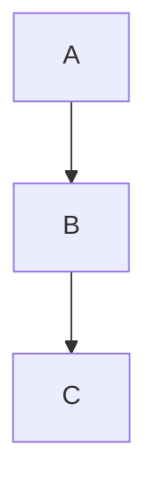

# Orinuno documentation site

Astro + Starlight documentation site for [Orinuno](https://github.com/Samehadar/orinuno).
Deployed to GitHub Pages at <https://samehadar.github.io/orinuno/>.

## Local development

Requires Node.js 20+ and pnpm. If pnpm is not installed, enable it via
Corepack (bundled with Node):

```sh
corepack enable
corepack prepare pnpm@9.15.0 --activate
```

Then, from this directory:

```sh
pnpm install
pnpm dev          # open http://localhost:4321/orinuno/
pnpm build        # production build (runs astro check + links-validator)
pnpm preview      # preview the production build locally
```

`pnpm predev` and `pnpm prebuild` automatically mirror the SVG diagrams
from `../docs/images/` into `./public/diagrams/` so Astro can serve them
as static assets. The destination is `.gitignored`; the PlantUML source
files in `../docs/` remain the single source of truth.

## Updating the OpenAPI snapshot

`starlight-openapi` reads from the committed `./openapi.json`. To refresh
it, start the Spring Boot service and dump the live spec:

```sh
# From the repo root, after running the service locally:
curl -sS http://localhost:8080/v3/api-docs > docs-site/openapi.json
```

Then rebuild the docs site and verify the generated pages under
`/api/reference/`.

## Adding a new page

1. Create the Markdown or MDX file under `src/content/docs/<group>/<slug>.md`.
2. Add a frontmatter block with at least `title` and `description`.
3. If you want the page in the sidebar (most cases), register its slug in
   the `sidebar` config in [`astro.config.mjs`](./astro.config.mjs).
4. For i18n parity, add a matching stub under `src/content/docs/ru/...`.

## Adding a Mermaid diagram

Just use a fenced code block:

````md

````

Rendering is handled client-side by
[`astro-mermaid`](https://www.npmjs.com/package/astro-mermaid) and follows
the current theme (dark/light).

## Reusing PlantUML SVGs

The PlantUML `.puml` sources live in `../docs/` and are rendered by the
`render-diagrams.yml` workflow on push. Reference them from MDX/Markdown
as static assets:

```md

```

The leading `/orinuno/` is required because Starlight serves the site at
that base path.

## Link validation

`starlight-links-validator` runs on `pnpm build`. If a page links to a
non-existent slug or a missing anchor, the build fails. Fix the link or
add the missing page, then rerun the build.

## Deploy

GitHub Pages deploy is wired in `.github/workflows/docs-deploy.yml`. It
triggers on pushes to `master` that touch `docs-site/**`, `*.md` in the
repo root, or the workflow itself. No manual action is required once
Pages is set to "GitHub Actions" in Settings → Pages.
