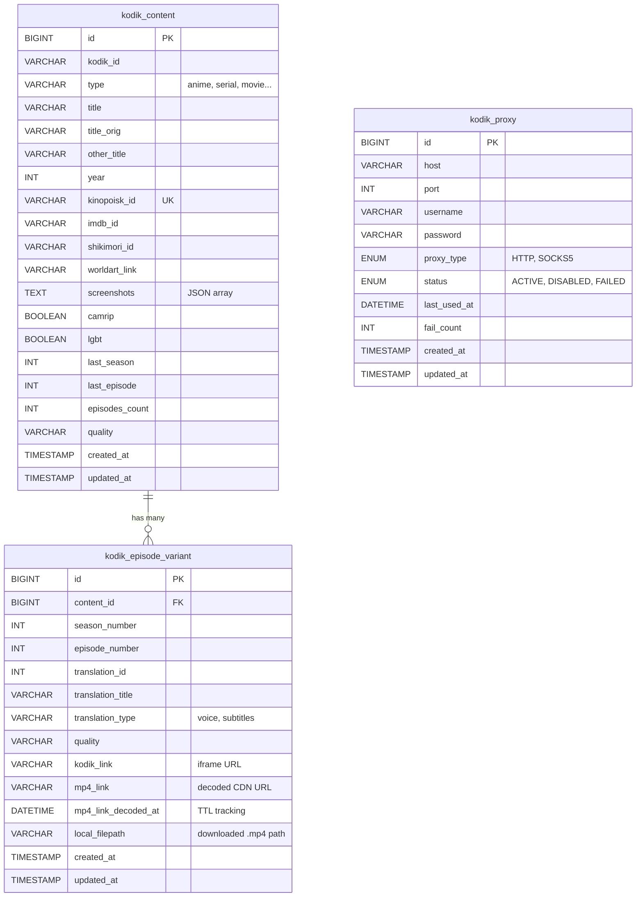

Orinuno uses MySQL 8 with Liquibase-managed migrations and MyBatis XML
mappers. The schema is small on purpose: three tables, all InnoDB, all
`utf8mb4_unicode_ci`.

## Entity relationships

## Tables

| Table | Purpose | Unique key |
| --- | --- | --- |
| `kodik_content` | Content metadata, one row per work | `kinopoisk_id` |
| `kodik_episode_variant` | Per-episode, per-translation variants with decoded mp4 links, TTL tracking, and local file paths | `(content_id, season_number, episode_number, translation_id)` |
| `kodik_proxy` | Proxy pool for rotation | `(host, port)` |

## Critical conventions

- **`COALESCE` on upsert.** When upserting `kodik_episode_variant`, the SQL
  uses `COALESCE(VALUES(mp4_link), mp4_link)`. This preserves a valid
  decoded link if a fresh API response happens to come without one.
- **`mp4_link_decoded_at`.** Every `UPDATE` of `mp4_link` sets this column
  to `NOW()`. The TTL refresh job uses it to find expired links.
- **Whitelisted `sortBy` and `order`.** The content list endpoint allows
  sorting by a fixed set of columns. The MyBatis XML uses `${...}`
  interpolation for those two fields only, and the controller validates the
  incoming values against a hard-coded whitelist before passing them in.

## Migrations

- Path: `src/main/resources/com/orinuno/db/changelog/scripts/`
- File naming: `YYYYMMDDHHMMSS_description.sql`
- Each file starts with `--liquibase formatted sql` and a
  `--changeset orinuno:YYYYMMDDHHMMSS` line.
- Every new migration must be registered in `liquibase-changelog.yaml`.

## Related

- [Kodik API flow](/orinuno/architecture/kodik-api-flow/)
- [Operations → TTL refresh](/orinuno/operations/ttl-refresh/)
