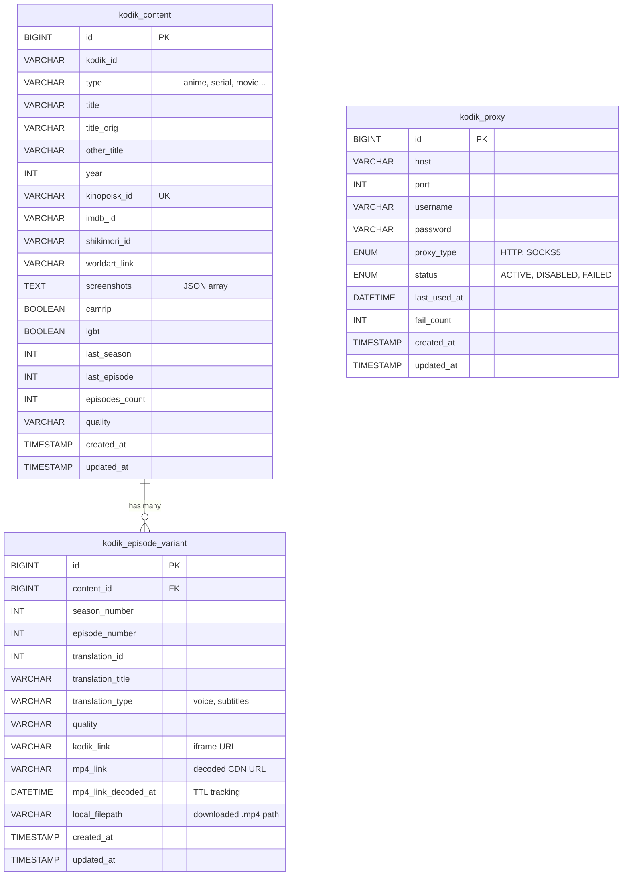

Orinuno uses MySQL 8 with Liquibase-managed migrations and MyBatis XML
mappers. Tables are grouped by [bounded context (ADR 0016)](https://github.com/Samehadar/orinuno/blob/master/docs/adr/0016-architecture-trajectory.md):
each context owns its own changelog directory under
`com/orinuno/db/changelog/<context>/`, and cross-context FK constraints
are deliberately forbidden (so a future per-source service split is a
refactor, not a rewrite). All tables are InnoDB and `utf8mb4_unicode_ci`.

## Entity relationships

```mermaid
erDiagram
    kodik_content {
        BIGINT id PK
        VARCHAR kodik_id
        VARCHAR type "anime, serial, movie..."
        VARCHAR title
        VARCHAR title_orig
        VARCHAR other_title
        INT year
        VARCHAR kinopoisk_id UK
        VARCHAR imdb_id
        VARCHAR shikimori_id
        VARCHAR worldart_link
        TEXT screenshots "JSON array"
        BOOLEAN camrip
        BOOLEAN lgbt
        INT last_season
        INT last_episode
        INT episodes_count
        VARCHAR quality
        TIMESTAMP created_at
        TIMESTAMP updated_at
    }

    kodik_episode_variant {
        BIGINT id PK
        BIGINT content_id FK
        INT season_number
        INT episode_number
        INT translation_id
        VARCHAR translation_title
        VARCHAR translation_type "voice, subtitles"
        VARCHAR quality
        VARCHAR kodik_link "iframe URL"
        VARCHAR mp4_link "decoded CDN URL"
        DATETIME mp4_link_decoded_at "TTL tracking"
        VARCHAR local_filepath "downloaded .mp4 path"
        TIMESTAMP created_at
        TIMESTAMP updated_at
    }

    kodik_proxy {
        BIGINT id PK
        VARCHAR host
        INT port
        VARCHAR username
        VARCHAR password
        ENUM proxy_type "HTTP, SOCKS5"
        ENUM status "ACTIVE, DISABLED, FAILED"
        DATETIME last_used_at
        INT fail_count
        TIMESTAMP created_at
        TIMESTAMP updated_at
    }

    kodik_content ||--o{ kodik_episode_variant : "has many"
```

## Tables

| Context | Table | Purpose | Unique key |
| --- | --- | --- | --- |
| `kodik` | `kodik_content` | Content metadata, one row per work | `kinopoisk_id` |
| `kodik` | `kodik_episode_variant` | Per-episode, per-translation variants with decoded mp4 links, TTL tracking, and local file paths | `(content_id, season_number, episode_number, translation_id)` |
| `kodik` | `kodik_proxy` | Proxy pool for rotation | `(host, port)` |
| `kodik` | `kodik_decoder_path_cache` | Persistent cache of decoder POST path per netloc | `netloc` |
| `kodik` | `kodik_calendar_state` | Last calendar snapshot per `shikimori_id` (CAL-6) | `shikimori_id` |
| `kodik` | `kodik_calendar_outbox` | Calendar deltas with watermark | auto-incrementing seq |
| `kodik` | `kodik_content_enrichment` | Raw + enriched metadata (Shikimori / MAL / Kinopoisk) (META-1) | `kodik_content_id` |
| `jutsu` | `jutsu_title` (P1a) | jut.su catalog mirror (L1 cache) — slug, titles, status, poster, last_synced_at | `slug` |
| `jutsu` | `jutsu_episode` (P1a) | jut.su episode metadata + qualities — embedUrl, season, episode, last_synced_at | `(title_slug, season, episode)` |
| `jutsu` | `jutsu_sync_state` (P1a) | Singleton row tracking the last full crawl + the notice walk cursor + an in-progress flag | singleton (`id=1`) |
| `core` | `orinuno_parse_request` | Async parse-request log (Phase 2) | `request_hash` (active rows only) |
| `core` | `episode_source` | Provider-agnostic source-per-episode (ADR 0005) | `(content_id, season, episode, source_type, source_id)` |
| `core` | `episode_video` | Decoded URLs per quality with TTL (ADR 0005) | `(episode_source_id, quality)` |

## Critical conventions

- **`COALESCE` on upsert.** When upserting `kodik_episode_variant`, the SQL
  uses `COALESCE(VALUES(mp4_link), mp4_link)`. This preserves a valid
  decoded link if a fresh API response happens to come without one.
- **`mp4_link_decoded_at`.** Every `UPDATE` of `mp4_link` sets this column
  to `NOW()`. The TTL refresh job uses it to find expired links.
- **Whitelisted `sortBy` and `order`.** The content list endpoint allows
  sorting by a fixed set of columns. The MyBatis XML uses `${...}`
  interpolation for those two fields only, and the controller validates the
  incoming values against a hard-coded whitelist before passing them in.
- **No cross-context FK constraints.** Cross-context references are soft
  (raw column with the other context's PK value, no FK). This makes a
  future per-source service split a refactor instead of a rewrite — see
  ADR 0016.
- **`jutsu_sync_state` singleton row.** Acquired through
  `JutsuNoticeLockService` with an atomic acquire-or-recover update
  (`SET notice_walk_in_progress = TRUE WHERE id = 1 AND
  (notice_walk_in_progress = FALSE OR updated_at < :staleBefore)`). Lock
  acquisition is `@Transactional` and lives in its own `@Service` to dodge
  the Spring AOP self-invocation pitfall.

## Migrations

- Path: `src/main/resources/com/orinuno/db/changelog/scripts/`
- File naming: `YYYYMMDDHHMMSS_description.sql`
- Each file starts with `--liquibase formatted sql` and a
  `--changeset orinuno:YYYYMMDDHHMMSS` line.
- Every new migration must be registered in `liquibase-changelog.yaml`.

## Related

- [Kodik API flow](/orinuno/architecture/kodik-api-flow/)
- [Operations → TTL refresh](/orinuno/operations/ttl-refresh/)
