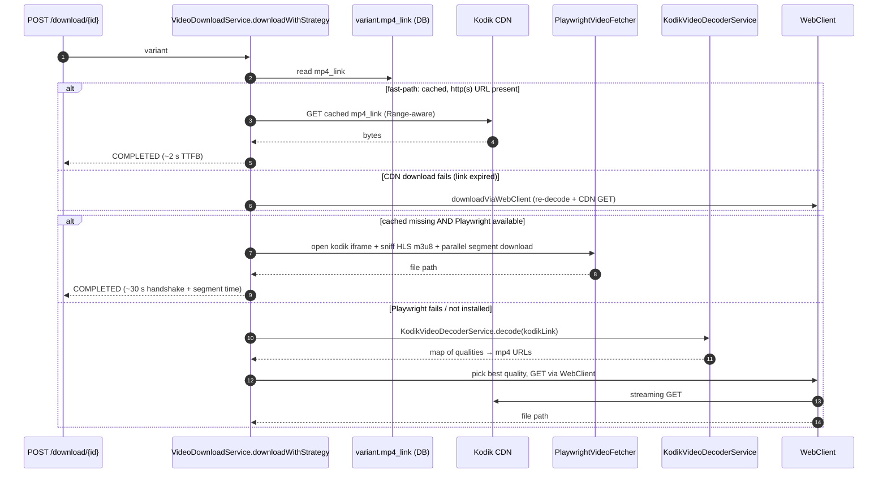

orinuno exposes four distinct ways to get a Kodik video out of the
service. They look similar in the demo UI but have different
guarantees and performance profiles. Pick the one that matches your
intent — this page is the decision table.

## 1. Decision table

| Goal | Endpoint | Strategy chain | Latency | Notes |
| --- | --- | --- | --- | --- |
| Save a file locally for repeat playback | `POST /api/v1/download/{variantId}` | fast-path CDN → Playwright HLS → WebClient direct MP4 | depends (see §3) | Background job, returns `IN_PROGRESS` immediately. Poll status. |
| Inline `<video>` playback without pre-download | `GET /api/v1/stream/{variantId}` | local file → Playwright (synchronous) → CDN fallback | first call slow (~30 s) — subsequent fast | Returns 200 + `Range`-aware bytes. |
| External player (VLC / mpv / ffmpeg) | `GET /api/v1/hls/{variantId}/manifest` | live decode + URL absolutise | ~3–5 s | Returns m3u8 — proxied/absolutised. Use `…/url` for the raw m3u8 URL only. |
| Just the m3u8 URL (no manifest body) | `GET /api/v1/hls/{variantId}/url` | live decode | ~3–5 s | One field response, useful for a thin wrapper. |
| iframe embed without any decode | `GET /api/v1/embed/{idType}/{id}` | Kodik `/get-player` | <1 s | Returns the kodikplayer.com iframe URL — no mp4 link, no Playwright. |

The two demo-UI buttons that often get confused — **Download** and
**▶ Download & Play** — hit the **same** backend endpoint
(`POST /api/v1/download/{variantId}`). The difference is purely UX:

- **Download** kicks off the job and stays on the variant list.
- **▶ Download & Play** kicks off the job and, on `COMPLETED`, opens the
  player modal pointing at `/api/v1/stream/{id}`.

Both go through the same `downloadWithStrategy()` chain described below.

## 2. Strategy chain (downloadWithStrategy)

`POST /api/v1/download/{variantId}` does not pick a strategy up front.
It tries the cheapest path first and falls through if it can't proceed:

The dispatch is in
[`VideoDownloadService.downloadWithStrategy`](https://github.com/Samehadar/orinuno/blob/master/src/main/java/com/orinuno/service/VideoDownloadService.java).
The fast-path is the cheapest because it skips both Playwright and the
8-step decoder pipeline.

## 3. Performance numbers

Wall-clock numbers from the [video-download architecture audit](/orinuno/architecture/video-download/)
(macOS dev workstation, MacBook Pro M2, 1 Gbps wired, US east, no proxies):

| Path | Time-to-first-byte | Time-to-completion (~50 MB episode) | Throughput vs WebClient |
| --- | --- | --- | --- |
| Fast-path (cached `mp4_link` → CDN) | ~2 s | ~5–10 s | ~1× baseline (CDN-bound) |
| Playwright HLS (parallel segments) | ~30 s handshake | ~10–20 s after handshake | ~9× WebClient (parallel `.ts` GETs, `hlsConcurrency=16`) |
| WebClient direct MP4 (re-decode + GET) | ~5 s decode + TTFB | ~30–60 s | 1× baseline |

The fast-path is dramatically cheaper but only available **after the
first decode has succeeded** — i.e. once `mp4_link` is populated. CDN
links are TTL-bound (`orinuno.decoder.link-ttl-hours = 20`), refreshed
in background by `DecoderMaintenanceScheduler`.

## 4. phaseHint glossary

The demo UI surfaces a `phaseHint` string in the progress card. They
are derived purely client-side in
[`ContentDetailView.vue → getProgressView`](https://github.com/Samehadar/orinuno/blob/master/demo/src/views/ContentDetailView.vue)
based on which counters the backend has reported. Use this as the
runtime cheat sheet:

| `phaseHint` | What's happening | Healthy P95 |
| --- | --- | --- |
| `HLS segments (Playwright)` | Playwright opened the player, parsed the m3u8, and is downloading `.ts` segments in parallel | varies — driven by `totalSegments` |
| `Direct MP4 (CDN)` | WebClient is streaming a single MP4 with `Content-Length` known | ~30–60 s per ~50 MB |
| `Direct MP4 (CDN, streaming)` | WebClient is streaming MP4 but the response had no `Content-Length` | same as above; UI shows total-bytes-only |
| `Browser handshake (Playwright, up to 30s)` | Playwright is still loading the player iframe, no video URL captured yet | < 30 s |
| `Playwright timed out — falling back to direct MP4` | The 30 s Playwright budget elapsed without sniffing HLS; chain fell back to WebClient | < 45 s before the actual download begins |
| `Decoding fresh CDN URL (fallback)` | Decoder is running in the WebClient fallback (8-step pipeline) | < 5 s decode + TTFB |

## 5. When each path doesn't work

| Failure | Symptom | Likely cause | Fix |
| --- | --- | --- | --- |
| `mp4_link` saved as literal `"true"` | Fast-path skipped, Playwright fired | Geo-blocked decode → `_geo_blocked` sentinel | Run from an unaffected region; the migration `20260425010000_cleanup_invalid_mp4_link.sql` nulls bad rows on boot |
| Playwright returns `null` after 30 s | Indeterminate progress bar stays at 0 % | Player iframe can't reach Kodik or is geo-blocked | WebClient fallback runs automatically; or set `orinuno.playwright.enabled=false` to skip |
| WebClient gets `403` from CDN | `IN_PROGRESS` → `FAILED` | Cached `mp4_link` expired beyond TTL | Re-decode via `POST /api/v1/parse/decode/variant/{id}` |
| Stream endpoint hangs ~30 s on first call | `GET /stream/{id}` blocks | Local file missing, kicks Playwright synchronously | Pre-download via `POST /download/{id}` then call `/stream` |
| HLS endpoint returns 502 | none from manifest body | Decoder returned no m3u8-eligible URL | Fall back to download or embed pathway |
| Embed endpoint returns 404 | `error: Kodik has no player for…` | Kodik genuinely has no player for that external id | Don't retry — the id is wrong or unsupported |
| Embed endpoint returns 503 | `error: registry empty` | Token registry empty | See [parser-kodik integration → §1](/orinuno/operations/parser-kodik-integration/#1-pre-flight-checklist) |

## See also

- [Video download](/orinuno/architecture/video-download/) — full strategy chain reference
- [Video decoding](/orinuno/architecture/video-decoding/) — the 8-step pipeline used by both Playwright and WebClient paths
- [HLS manifest](/orinuno/architecture/hls-manifest/) — the live-decode manifest endpoint
- [API → Embed](/orinuno/api/embed/) — the iframe-only shortcut
- [parser-kodik integration](/orinuno/operations/parser-kodik-integration/) — observability and rate-limit context
