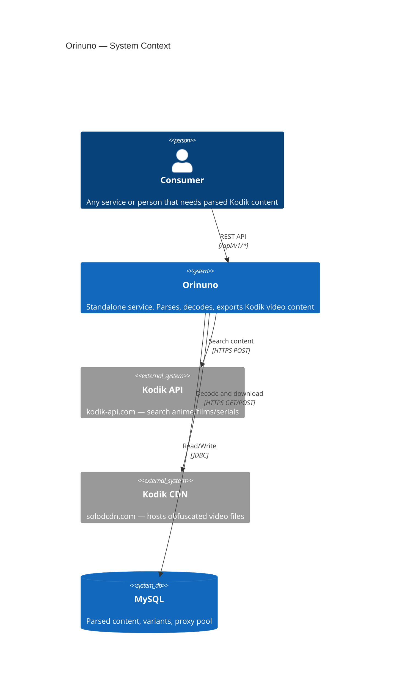
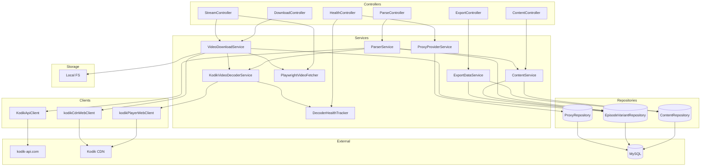

Orinuno is a single-process Spring Boot WebFlux service that fronts the public
Kodik API, decodes obfuscated video URLs, stores metadata in MySQL, and
exposes a versioned REST surface for consumers. The diagrams on this page
cover three levels: system context, internal components, and the PlantUML
container view.

## System context (C4)

## Component diagram

## Container view (PlantUML)

Rendered from [`docs/0_architecture_overview.puml`](https://github.com/Samehadar/orinuno/blob/master/docs/0_architecture_overview.puml)
by the repository's PlantUML workflow.

## Key flows

1. **Search and parse** — `POST /api/v1/parse/search` → Kodik API (`/search` with up to 70 filters) → save content, variants, and raw `material_data` to MySQL. See [Kodik API flow](/orinuno/architecture/kodik-api-flow/).
2. **Decode** — `POST /api/v1/parse/decode/{id}` decodes every variant of a content item; `POST /api/v1/parse/decode/variant/{variantId}` decodes a single variant (used by the demo UI's per-row "Decode" button). Both fetch the player iframe via the proxy pool → extract JS params → resolve the video-info endpoint with a fallback chain → brute-force ROT decode → store `mp4_link`. See [Video decoding](/orinuno/architecture/video-decoding/).
3. **HLS manifest** — `GET /api/v1/hls/{id}/manifest` → fresh decode → fetch m3u8 → absolutize URLs → return playlist. See [HLS manifest](/orinuno/architecture/hls-manifest/).
4. **Export** — `GET /api/v1/export/{id}` → structured JSON grouped by season → episode → variant. Schema is stable and intended for downstream consumers.
5. **TTL refresh** — `@Scheduled` re-decodes mp4 links older than `link-ttl-hours`. See [TTL refresh](/orinuno/operations/ttl-refresh/).

## Related

- [Kodik API flow](/orinuno/architecture/kodik-api-flow/)
- [Video decoding](/orinuno/architecture/video-decoding/)
- [Schema drift](/orinuno/architecture/schema-drift/)
- [Database](/orinuno/architecture/database/)
