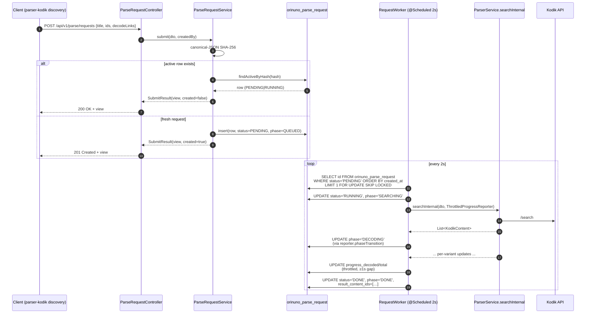

## Why

The synchronous `POST /api/v1/parse/search` endpoint stays open for the
entire decode cycle, which can run for tens of minutes on large anime
serials (e.g. Naruto: 220 episodes × N translations). Phase 2 introduces
an async parse-request log so callers — primarily
[parser-kodik discovery](#parser-kodik-discovery-flow) — can submit work,
get an id immediately, and poll progress (or, in production, react to
`/api/v1/export/ready` updates) without holding HTTP connections open.

The existing synchronous endpoint is **preserved** — it remains the
fastest path for human-driven exploration via the demo site.

## High-level flow



## Idempotency contract

Every incoming `ParseRequestDto` is normalised (trim/lowercase title,
strip blank ids, keep `decodeLinks` as-is) and hashed with SHA-256 over a
canonical JSON form (alphabetically sorted keys, `null` fields omitted).

- If a row with the same hash exists in `(PENDING, RUNNING)`, the
  controller returns **200 OK** and the existing row.
- Otherwise a new row is inserted and the controller returns
  **201 Created**.

Completed rows (`DONE` / `FAILED`) do not block re-submission — once the
work is finished the consumer is expected to read the result through
`/api/v1/export/ready` and re-submit if it wants a fresh decode.

## Phase semantics

| `phase`      | When                                                                            |
|--------------|---------------------------------------------------------------------------------|
| `QUEUED`     | Inserted, not yet claimed.                                                      |
| `SEARCHING`  | Worker claimed the row; first Kodik `/search` call in flight.                   |
| `DECODING`   | Search done, per-variant decode running. `progress_decoded/total` are non-zero. |
| `DONE`       | Terminal — `result_content_ids` populated, `finished_at` set.                   |
| `FAILED`     | Terminal — `error_message` populated, `retry_count` reflects attempts.          |

`phase` transitions are flushed immediately by `ThrottledProgressReporter`,
even when other progress updates are batched (≥1s gap). `phase` is
intended for UI feedback; durable orchestrators should still treat
`status` (`PENDING|RUNNING|DONE|FAILED`) as the source of truth.

## SLA targets

These are guideline numbers for current single-source workloads, not a
contractual SLO. Phase 4/5 will add Micrometer metrics and proper
percentile budgets.

| Stage                                                | Target (P95)         | Notes                                                            |
|------------------------------------------------------|----------------------|------------------------------------------------------------------|
| `POST /api/v1/parse/requests` round-trip             | < 200 ms             | Two queries: `findActiveByHash` + `insert`.                      |
| Time from PENDING → SEARCHING                        | < 4 s                | Worker poll = 2 s; row may have been queued in the same tick.    |
| Single-content search (no decode)                    | < 5 s                | Bound by Kodik `/search` latency.                                |
| Single-variant decode (warm Playwright)              | 2–10 s               | Heavily geo-dependent; cold Playwright adds ~30 s.               |
| 220-episode serial decode                            | 30–90 min            | Bound by Kodik request-delay budget × variant count.             |
| Stale RUNNING recovery                               | < 60 s               | `recoverStale` runs every 60 s, threshold = 5 min heartbeat.     |

## No-polling rule for parser-kodik

`parser-kodik` discovery **must not** poll
`GET /api/v1/parse/requests/{id}` to drive its own state machine. The
authoritative completion signal is the existing
`GET /api/v1/export/ready?updatedSince=…` endpoint, which already powers
the live integration tests. The parse-request log exists for
observability and idempotency only.

`GET /api/v1/parse/requests` (list) **is** allowed — parser-kodik uses it
with `?status=PENDING&limit=0` to read the `X-Total-Count` header for
backpressure ("does orinuno already have N pending requests?"). This is
a single cheap query, not a per-id poll.

## Stale request recovery

`RequestWorker.recoverStale` runs on a `@Scheduled(60s)` cycle. Any
`RUNNING` row whose `last_heartbeat_at` is older than
`orinuno.requests.stale-after-ms` (default 5 min) is:

- transitioned back to `PENDING` (and `phase=QUEUED`) with
  `retry_count + 1`, **or**
- transitioned to `FAILED` (and `phase=FAILED`) when
  `retry_count + 1 >= orinuno.requests.max-retries`.

This protects against worker crashes / OOM / pod evictions without
needing distributed locks.

## Related configuration

```yaml
orinuno:
  requests:
    worker-poll-ms: 2000        # @Scheduled fixedDelay
    stale-recovery-ms: 60000
    stale-after-ms: 300000
    progress-flush-ms: 1000     # ThrottledProgressReporter granularity
    max-retries: 3
    default-page-limit: 50
    max-page-limit: 200
```

## See also

- [Kodik /list proxy](kodik-api-flow.md) — the discovery side (read).
- [Video decoding](video-decoding.md) — what `phase=DECODING` actually does.
- `TECH_DEBT.md` → `TD-PR-1`/`TD-PR-2`/`TD-PR-3` — known follow-ups.
