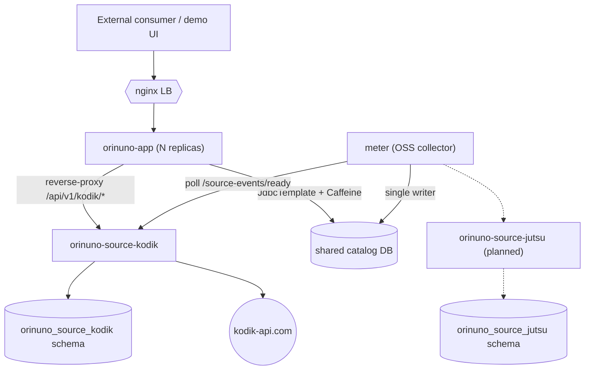

Orinuno is no longer a single-process monolith. As of ADR 0018 (the Kodik
split) and ADR 0020 (the OSS meter extraction), the running stack is:

- `orinuno-app` — public API gateway. Multi-instance capable. Stateless
  with respect to canonical catalog (reads from the shared DB through a
  Caffeine cache).
- `orinuno-source-kodik` — standalone Spring Boot deployable. Owns the
  Kodik HTTP client + decoder + token registry + the `kodik_*` MySQL
  schema. Serves the Kodik-side REST surface directly.
- `meter` — OSS catalog collector. Single writer of the shared canonical
  catalog schema (`catalog_content`, `catalog_episode`, …). Subscribes to
  every per-source service's event stream and reconciles into L3.
- `orinuno-source-jutsu` — planned for ADR 0019 Phase 4 (gated on
  14 days of `orinuno-source-kodik` prod stability).
- Reusable libraries — `kodik-sdk`, `jutsu-sdk`, `sibnet-sdk`,
  `aniboom-sdk`, `orinuno-source-contract`. Independent Maven artefacts
  with no Spring / MySQL / orinuno-specific dependencies.

## Topology



`app` is a horizontally-scalable replica set behind nginx. `sourceK` is the
standalone Kodik service; `meter` polls its event stream and is the single
writer of the canonical catalog schema. `app` reads catalog directly from
the same MySQL through a read-only DB user + Caffeine cache — no HTTP
hop between `app` and `meter`.

## Build profiles

Two Maven profiles (root `pom.xml`):

- **`full-split`** (default) — builds every module, including
  `orinuno-source-kodik` and `meter`. Matches the topology above. Used
  for production deploys and the bundled `docker compose up`.
- **`-P monolith`** — skips `orinuno-source-kodik` and `meter`. Produces
  only the libraries + `orinuno-app`. Useful for casual OSS contributors
  who don't want a 5-container stack on their laptop.

Trade-off after ADR 0018 Phase 5 (catalog cutover):

- `monolith` mode loses `/api/v1/catalog/*` because the canonical L3
  surface lives only in `meter`. Per-source endpoints
  (`/api/v1/kodik/*`, `/api/v1/embed/*`, etc.) keep working — they're
  served by `orinuno-app`'s own controllers against its local schema.
- `monolith` mode runs Kodik directly inside `orinuno-app`; with
  `ORINUNO_SOURCE_KODIK_BASE_URL` unset, the Phase 2.8 reverse-proxy
  filter stays dormant.

## Multi-instance `orinuno-app`

`orinuno-app` is stateless w.r.t. the canonical catalog — the shared DB
is the source of truth and per-instance Caffeine caches sit on the read
side. Horizontal scale-out behind nginx:

```sh
docker compose -f docker-compose.yml -f docker-compose.scale.yml up -d --scale app=3
curl http://localhost:8084/api/v1/health   # nginx round-robins across replicas
```

Per-instance cache lag is bounded by
`orinuno.catalog.cache.expire-after-write-seconds` (default 300 s).
Two replicas may serve different versions of a catalog row during that
window. Catalog churn is slow enough (Kodik dumps refresh once per
day, jut.su incrementally over hours) that this is acceptable for
catalog reads.

## Failure isolation

Each tier has its own JVM and its own DB schema. Outage matrix:

| Outage | Public REST impact |
| --- | --- |
| `orinuno-source-kodik` down | `/api/v1/kodik/*` etc. return 502/503 via the gateway. Catalog reads keep working from cache + DB. JutSu unaffected. |
| `meter` down | Catalog updates freeze. `orinuno-app`'s `/api/v1/catalog/*` keeps serving the last known state from the shared DB. |
| MySQL down | Everything goes red — but a single failure domain instead of cascading. |
| One `orinuno-app` replica down | nginx removes it from the LB rotation. |

## Shared DB pattern (why no HTTP between `orinuno` and `meter`)

ADR 0020 Decision §2 — `orinuno` reads canonical catalog directly from
the same MySQL instance that `meter` writes to, via a second
`JdbcTemplate` + read-only MyBatis layer. DB user separation
(`orinuno_meter_writer` CRUD vs. `orinuno_catalog_reader` SELECT-only)
enforces the boundary at the storage layer.

Cost the design accepts: schema is a shared contract. Migrations require
coordination across the two modules — manageable because they live in
the same monorepo.

Trade-offs considered and rejected:

- Single OSS process (drop `orinuno`, rename to `meter`) — loses
  multi-instance read scaling.
- HTTP API between `orinuno` and `meter` — adds a hot-path hop and
  couples read-path availability to `meter` JVM health.
- Kafka outbox from day 1 — operationally heavier; OSS docker-compose
  stack acquires a broker; catalog churn is too low to justify it
  today.

## Why shared DB now, Kafka later

ADR 0020 Decision §6 records a future migration to event sourcing
(future ADR 0021). Path forward is open at any time — no data-loss
migration required. Triggers we'd react to:

1. Schema-coupling pain — ≥3 mapper breakage incidents per quarter from
   uncoordinated schema changes.
2. Multi-DC deploys — read-locality matters and a single MySQL hop
   becomes too expensive.
3. Read load — Caffeine miss-rate > 80% or DB connection-pool
   starvation.
4. A second non-`orinuno` OSS consumer (Telegram bot, search indexer)
   wants real-time catalog updates.

When any trigger fires:

- `meter` gains a transactional outbox (`catalog_event_outbox` written
  in the same transaction as `catalog_*` mutations);
- a `MeterOutboxPublisher` drains the outbox into Kafka topic
  `orinuno.catalog.events`;
- `orinuno` consumes the topic into a local read store (per-replica
  embedded DB or in-memory + Kafka replay-from-earliest at startup);
- the read-only repository contract from ADR 0018 Phase 5.4 keeps its
  current shape — only the underlying source swaps.

Until then, the shared-DB pattern keeps the OSS docker-compose stack
minimal (no Kafka broker) while still delivering multi-instance
`orinuno`.

## See also

- [ADR 0018](https://github.com/Samehadar/orinuno/blob/master/docs/adr/0018-per-source-service-split-kodik.md)
  — per-source split: Kodik first.
- [ADR 0019](https://github.com/Samehadar/orinuno/blob/master/docs/adr/0019-per-source-service-split-jutsu.md)
  — per-source split: JutSu next (deferred).
- [ADR 0020](https://github.com/Samehadar/orinuno/blob/master/docs/adr/0020-oss-meter-extraction.md)
  — OSS meter extraction post-mortem.
