Kodik protects direct video URLs with a two-stage obfuscation: a ROT-style
substitution cipher followed by URL-safe Base64. The decoder walks an
eight-step pipeline to unwrap it, with brute-force across all 26 ROT shifts
and a proxy-aware HTTP client underneath.

## The eight steps

```mermaid
flowchart LR
    A["Kodik iframe URL<br/>//kodik.info/seria/..."] --> B["Load iframe HTML"]
    B --> C["Extract JS params<br/>urlParams, type, hash, id"]
    C --> D["Load player JS<br/>app.player_*.js"]
    D --> E["Extract POST URL<br/>atob('...')"]
    E --> F["POST /gvi or /ftor<br/>with form data"]
    F --> G["Encoded video URLs<br/>in JSON response"]
    G --> H["ROT decode<br/>brute-force all 26 shifts"]
    H --> I["Base64 decode<br/>URL-safe variant"]
    I --> J["Direct MP4 URL<br/>https://p12.solodcdn.com/..."]
```

1. **Load the iframe page** — `GET https://kodik.info/seria/{id}/...`, routed
   through the proxy pool with a direct fallback.
2. **Extract JS params** — regex pulls `urlParams`, `type`, `hash`, `id` from
   the embedded script tag.
3. **Load the player JS** — `GET /assets/js/app.player_*.js`. The exact
   filename changes, so we extract it from the iframe HTML on each call.
4. **Extract the POST endpoint** — inside the player JS we look for an
   `atob("...")` call whose decoded value is the video-info path. We cache
   the last known path (`/gvi`, `/kor`, `/ftor`, `/seria`) and fall back to
   the full chain if it fails.
5. **POST the video-info request** — `application/x-www-form-urlencoded` with
   the four params plus `bad_user=false`.
6. **Parse the JSON response** — the body looks like
   `{"links":{"720":[{"src":"encoded..."}]}}`.
7. **ROT decode** — try all 26 shifts. We cache the last working shift; if
   the cached shift fails, we fall through to the full brute-force loop.
8. **URL-safe Base64 decode** — replace `-` → `+`, `_` → `/`, pad with `=`,
   then `Base64.getDecoder().decode(...)`.

## Why brute-force

`KodikDownloader` (one of the reference projects) hard-codes ROT +18. That
works today, but has failed on earlier Kodik updates. Brute-force survives
shift changes without a deploy; the overhead is a handful of integer
comparisons per decode, which is free compared to the network cost.

## Proxy and retry

Every outbound HTTP call goes through `ProxyWebClientService`, which picks a
proxy from `kodik_proxy` using round-robin and retries against direct if the
proxy fails. The decoder itself is wrapped in `Retry.backoff(maxRetries, 2s)`,
so a transient 5xx or network error triggers exponential backoff (2s, 4s,
8s).

## Caching

- **ROT shift** — the last successful shift is cached in-memory.
- **POST endpoint** — the last working endpoint is cached per player JS
  fingerprint.

Both caches are process-local; a restart re-learns them from the first live
decode.

## Related

- [HLS manifest](/orinuno/architecture/hls-manifest/)
- [Video download](/orinuno/architecture/video-download/)
- [Operations → Proxy pool](/orinuno/operations/proxy-pool/)
