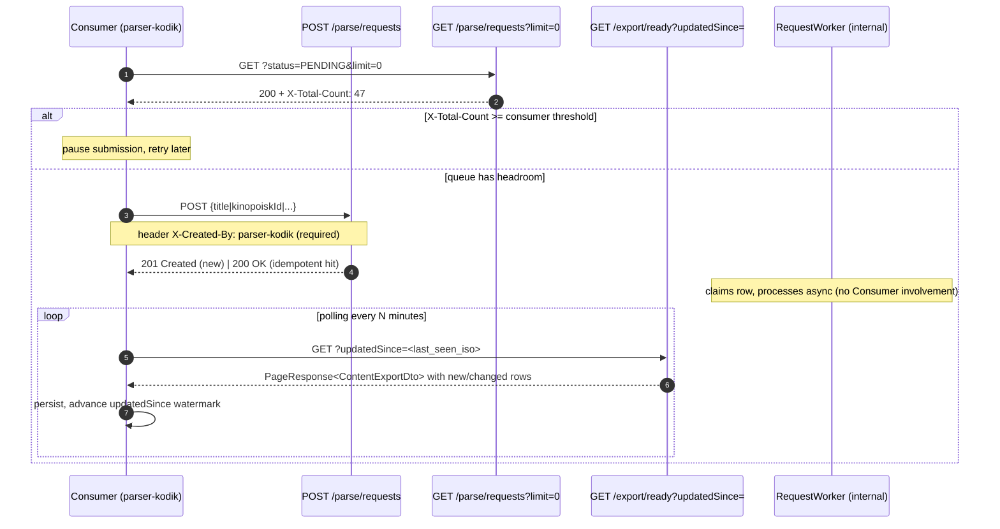

This page is the single entry point for any downstream service that wants
to integrate with orinuno — primarily
[parser-kodik](https://github.com/kinodostup/backend-master/tree/main/parser-kodik),
but the contract below applies to any consumer that submits work and
consumes results.

If you only have 30 seconds: run the four pre-flight checks below, submit
via `POST /api/v1/parse/requests`, and consume completion via
`GET /api/v1/export/ready?updatedSince=…`. Do **not** poll
`/parse/requests/{id}`.

## 1. Pre-flight checklist

Before any consumer sends its first `POST /parse/requests`, hit these
four endpoints. They surface the failure modes that account for ~all
"orinuno is broken" incidents.

| Order | Endpoint | Pass condition | What it tells you |
| --- | --- | --- | --- |
| 1 | `GET /api/v1/health` | `{status: UP, service: orinuno}` | Spring context booted |
| 2 | `GET :8081/actuator/health` | `{status: UP}` (with `db.status=UP`) | DB pool is connected and Liquibase migrations applied |
| 3 | `GET /api/v1/health/tokens` | `liveCount > 0` | At least one Kodik token exists in `stable\|unstable\|legacy`. **Common gotcha**: a fresh checkout has `data/kodik_tokens.json` empty — every Kodik call will fail with `503` until you seed via `KODIK_TOKEN` env or manual edit. See [getting started → quick start](/orinuno/getting-started/quick-start/). |
| 4 | `GET /api/v1/health/schema-drift` | `status: CLEAN` (or known drift you've vetted) | Kodik response shape matches what `KodikResponseMapper` was compiled for |

For a one-shot aggregate of all four, use the dedicated endpoint:

```sh
curl -sS http://localhost:8085/api/v1/health/integration | jq
```

It returns a single document with `status: READY|DEGRADED|BLOCKED` plus
the per-check details so a consumer can implement a single readiness
probe instead of fanning out across four URLs.

## 2. Submit-and-consume contract



### Required request shape

```http
POST /api/v1/parse/requests
Host: orinuno:8085
Content-Type: application/json
X-API-KEY: <your key, when configured>
X-Created-By: parser-kodik

{
  "kinopoiskId": "326",
  "decodeLinks": true
}
```

- `X-Created-By` is **required** (non-blank). Empty / missing returns `400`.
  This header is the rate-limit key (see §3) and shows up in every metric
  and log line that involves the request.
- `decodeLinks: true` triggers per-variant decode after search. `false`
  ingests metadata only.
- Payload must contain at least one of: `title`, `id`, `playerLink`,
  `kinopoiskId`, `imdbId`, `mdlId`, `worldartAnimationId`,
  `worldartCinemaId`, `worldartLink`, `shikimoriId`. Empty payload returns
  `400`.

### Idempotency

The submit hash is `SHA-256(canonical-json(dto))` over a normalised view
(trimmed/lowercased title, blank ids stripped). Hitting submit twice
with the same payload while the prior row is still `PENDING` or
`RUNNING` returns the existing row with `200 OK` and `created=false`.

### No per-id polling

Do **not** call `GET /parse/requests/{id}` in a loop to detect
completion. The authoritative completion signal is
`GET /api/v1/export/ready?updatedSince=…`, which already powers all live
integration tests. The parse-request log exists for **observability and
idempotency**, not for state-machine driving.

The only allowed list-endpoint call is the backpressure probe:
`GET /parse/requests?status=PENDING&limit=0` returns an empty body with
header `X-Total-Count: <n>`.

## 3. Throughput envelope

These are the production-relevant knobs. Tune cautiously — the defaults
were chosen to coexist with Kodik's tolerance for traffic from a single
IP.

| Knob | Default | Where | What it bounds |
| --- | --- | --- | --- |
| `orinuno.parse.rate-limit-per-minute` | `30` | [`OrinunoProperties.ParseProperties`](https://github.com/Samehadar/orinuno/blob/master/src/main/java/com/orinuno/configuration/OrinunoProperties.java) | Outbound calls to `kodik-api.com`. Token-bucket via `KodikApiRateLimiter`. Exhaustion → 2 s wait, then up to 30 s blocking acquire, then `RuntimeException`. |
| `orinuno.parse.inbound-rate-limit-per-minute` | `60` | `OrinunoProperties.ParseProperties` | **Inbound** submissions per `X-Created-By` value. Bucket4j-backed. Exhaustion → `429 Too Many Requests` with `Retry-After`. |
| `orinuno.kodik.request-delay-ms` | `500` | `KodikProperties` | Inter-decode pacing inside the per-content decode loop. |
| `orinuno.requests.worker-poll-ms` | `2000` | `RequestsProperties` | `RequestWorker.tick()` cadence. |
| `orinuno.requests.stale-after-ms` | `300000` | `RequestsProperties` | Heartbeat age that flips a `RUNNING` row back to `PENDING`. |
| `orinuno.kodik.token-failover-max-attempts` | `3` | `KodikProperties` | Retries with the next eligible token when Kodik returns "invalid token". |

Hard topology constraints (today, single-instance only — see §6):

- **One** `@Scheduled(2s)` worker thread per JVM, isolated on the
  `orinuno-sched-` pool.
- **One** decoder maintenance thread on the isolated
  `orinuno-decoder-maint-` pool (see [TD-PR-5](https://github.com/Samehadar/orinuno/blob/master/TECH_DEBT.md)).
- **HikariCP `maximum-pool-size = 10`** (Spring Boot default — not yet
  evaluated under sustained parser-kodik load).

### SLA targets (guideline, not contractual)

| Stage | P95 |
| --- | --- |
| `POST /parse/requests` round-trip | < 200 ms |
| `PENDING → SEARCHING` transition | < 4 s (worker poll = 2 s) |
| Single-content search (no decode) | < 5 s |
| Single-variant decode (warm Playwright) | 2–10 s |
| 220-episode serial decode | 30–90 min |
| Stale `RUNNING` recovery | < 60 s |

For the long-tail jobs the consumer must **never** hold an HTTP
connection open. Submit, drop, watch `/export/ready`.

Source: [parse-requests.md → SLA targets](/orinuno/architecture/parse-requests/#sla-targets).

## 4. Failure-mode catalog

What the consumer sees / what actually happened / what to do.

| Status | Body / header signal | What's wrong | What to do |
| --- | --- | --- | --- |
| `400` from `POST /parse/requests` | `error: id or title required` | Empty payload | Add at least one id field or `title`. |
| `400` from `POST /parse/requests` | `error: X-Created-By header is required` | Missing/blank `X-Created-By` | Set the header to your service name. |
| `400` from `POST /parse/requests` | `error: Unknown idType…` | Wrong path/value (`/embed/{idType}/{id}`) | Use one of the seven supported slugs (see [API → Embed](/orinuno/api/embed/)). |
| `401` | none | `X-API-KEY` missing/wrong (when api-key auth is configured) | Set `X-API-KEY` header. |
| `404` from `/embed/{type}/{id}` | `error: Kodik has no player for…` | Kodik returned `found:false` | The id genuinely doesn't exist on Kodik — don't retry. |
| `429` from `POST /parse/requests` | header `Retry-After: <seconds>` | Inbound rate limit hit (`X-Created-By` consumed budget) | Back off `Retry-After` seconds. Tune `orinuno.parse.inbound-rate-limit-per-minute` if legitimate. |
| `502` from `/embed/*` | `error: Kodik /get-player error: …` | Kodik returned a non-token error in body | Check `/health/schema-drift`. Often transient; safe to retry with backoff. |
| `503` from `/embed/*` | `error: registry empty\|all tokens dead` | Token registry has nothing usable | Check `/health/tokens`, seed a fresh `KODIK_TOKEN`. |
| Timeout on long decode | none — request returned `202` minutes ago | Worker pinned on a slow / VPN-induced decode | Check `orinuno_parse_request_processing_seconds` quantiles. See [TD-PR-5](https://github.com/Samehadar/orinuno/blob/master/TECH_DEBT.md) for the deadlock fix history. |
| `Warning: 199` header on `/api/v1/kodik/list` | header present | Schema drift detected during this call | Continue — body is still usable. Log the warning, expect a follow-up `/health/schema-drift` check. |
| Stuck `PENDING` queue | `X-Total-Count` keeps climbing | Worker not draining (crashed, deadlocked, or token-rejected) | Check `orinuno_parse_request_worker_tick_seconds` (no recent samples ⇒ worker dead) and `/health/tokens`. |

## 5. Observability dashboard

What to graph, what to alert on. All series are scraped at
`:8081/actuator/prometheus`.

### Core SLOs (every consumer should watch)

| Series | Purpose | Alert when |
| --- | --- | --- |
| `orinuno_parse_requests{status="PENDING"}` | Queue depth | sustained > N (consumer-defined) for > 10 min |
| `rate(orinuno_parse_requests_completed_total{outcome="DONE"}[5m])` | Throughput | drops to 0 while `PENDING > 0` |
| `rate(orinuno_parse_requests_completed_total{outcome="FAILED"}[5m])` | Error rate | > 10 % of total completions for > 5 min |
| `orinuno_parse_request_worker_tick_seconds{quantile="0.95"}` | Worker latency | > 5 s sustained |
| `orinuno_inbound_throttle_total{consumer="parser-kodik"}` | Inbound throttling | non-zero (means consumer is being slowed down) |
| `orinuno_kodik_calendar_fetch_total{outcome="error"}` | Calendar health | sustained > 0 |

### Pre-built dashboards

The repo ships a Grafana dashboard for the parse-request flow:
[`observability/grafana/dashboards/orinuno-parse-requests.json`](https://github.com/Samehadar/orinuno/blob/master/observability/grafana/dashboards/orinuno-parse-requests.json).

Bring up the local stack:

```sh
docker compose --profile observability up -d prometheus grafana
```

URLs in [monitoring → local Grafana stack](/orinuno/operations/monitoring/#local-grafana-stack).

### Logs to grep

- `[SCHEMA DRIFT]` (WARN) — Kodik changed something
- `KodikApiRateLimiter` (INFO) — outbound bucket exhausted
- `KodikEmbedController` (WARN) — embed-link resolve failed
- `RequestWorker` (INFO/WARN) — claim/process/recover events
- `KodikTokenRegistry` (INFO/WARN) — token tier transitions, dead-token quarantine

## 6. Horizontal scaling caveats

orinuno is currently **single-instance only**. Running multiple
replicas against the same DB will not corrupt data, but several
behaviours are not horizontally safe:

| Subsystem | Why not safe to replicate | Workaround |
| --- | --- | --- |
| `RequestWorker.tick()` | `FOR UPDATE SKIP LOCKED` works correctly across replicas — this part **is** safe | None needed. |
| `RequestWorker.recoverStale()` | Idempotent UPDATE — safe to run on every replica | None needed. |
| `KodikTokenLifecycle.scheduledRevalidation()` | Each replica probes Kodik with every token every 6 h — wasteful and may trip Kodik anti-abuse | Run on exactly one replica via leader election; or accept the duplicated probe traffic. |
| `DecoderMaintenanceScheduler` | Each replica picks the same expired-mp4 batch and decodes redundantly | Same — run on one replica until distributed lock arrives (see [TECH_DEBT.md](https://github.com/Samehadar/orinuno/blob/master/TECH_DEBT.md) TD-PR-1). |
| `KodikApiRateLimiter` | Per-process semaphore — N replicas multiply outbound rate by N | Set `orinuno.parse.rate-limit-per-minute` to `total_budget / N` on every replica. |

This will be revisited when [TD-PR-1](https://github.com/Samehadar/orinuno/blob/master/TECH_DEBT.md) (worker pool) lands.

## See also

- [Async parse requests](/orinuno/architecture/parse-requests/) — implementation details for `RequestWorker`, idempotency, phase semantics.
- [Monitoring](/orinuno/operations/monitoring/) — Grafana stack, full Prometheus catalog.
- [Kodik tokens](/orinuno/operations/kodik-tokens/) — tier model, registry file format, auto-discovery.
- [Schema drift](/orinuno/architecture/schema-drift/) — what `Warning: 199` means.
- [Quick start](/orinuno/getting-started/quick-start/) — token bootstrap.
