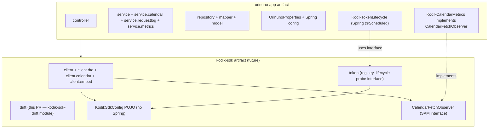

# ADR 0001 — Kodik SDK extraction

- **Status**: Accepted (pilot only — see "Scope of this ADR")
- **Date**: 2026-05-02
- **Deciders**: orinuno maintainers
- **Related**: BACKLOG.md → IDEA-SDK-1..4, transparency roadmap PR3

## Context

orinuno today is a single Maven module that mixes two concerns:

1. **A Kodik SDK** — `client/`, `client.dto.*`, `client.calendar`,
   `client.embed`, `token/`, `drift/`. These are stateless, reusable
   pieces of infrastructure that any other Kodik consumer (e.g. a future
   non-orinuno service) could lift wholesale.
2. **An orinuno service** — `controller/`, `service/`,
   `service.calendar`, `service.requestlog`, `service.metrics`,
   `repository/`, `mapper/`, `model/`, `configuration/`. These wire the
   SDK to MyBatis/MySQL, async parse-request log, REST endpoints,
   Liquibase migrations, demo UI.

Conflating them blocks two outcomes:

- A second Kodik consumer must depend on **the entire orinuno service**
  (Spring Boot + MyBatis + MySQL + Liquibase) just to use the typed
  Kodik client.
- The SDK code mutates internal-only assumptions (Spring component scan,
  `OrinunoProperties`, controller-bound DTO shapes) without ever
  exercising a "third-party consumer" surface.

The transparency roadmap (PR3) calls for a **pilot** extraction of one
package — `drift` — to prove the multi-module mechanics before doing the
larger split. This ADR records the target shape and the surgical points
that the larger split must address.

## Target shape

PR3 introduces only `kodik-sdk-drift` (and the multi-module pom). The
other SDK packages stay where they are; they need the surgical points
below before they can move.

## Surgical points (for the larger split, not this PR)

### 1. `OrinunoProperties` (the big blocker)

Today every `client.*` and `token.*` `@Component` constructor takes
`OrinunoProperties` (Spring `@ConfigurationProperties`). Moving any of
these into the SDK module would force the SDK to depend on Spring Boot
and `OrinunoProperties` itself.

**Decision**: introduce a **plain POJO** `KodikSdkConfig` in the SDK
exposing the SDK-relevant subset (`apiUrl`, `requestDelayMs`,
`tokenFile`, `tokenFailoverMaxAttempts`, …). `OrinunoProperties` then
implements that interface (or returns a derived `KodikSdkConfig` via a
method) so `kodik-sdk` knows nothing about Spring `@ConfigurationProperties`.

### 2. `client.calendar.KodikCalendarHttpClient → service.metrics.KodikCalendarMetrics`

The only inbound dependency from `client.*` to `service.*`. A real
extraction must invert it.

**Decision**: introduce a **SAM** observer interface in the SDK
(`CalendarFetchObserver` with one method per signal — `onSuccess`,
`onUpstreamError`, `onTransportError`, `onCacheHit`). The SDK ships a
no-op default. The orinuno-app module ships
`KodikCalendarMetrics implements CalendarFetchObserver` and registers it
as a Spring bean.

### 3. `KodikTokenLifecycle` (`@Scheduled`)

This Spring-bound class wraps a polling lifecycle around the SDK's
`KodikTokenRegistry`. It is stateful, time-driven, and uses Spring's
scheduler.

**Decision**: keep `KodikTokenLifecycle` in **orinuno-app** (the SDK
must not pull in Spring's scheduler). The SDK exposes a
`KodikTokenLifecycleProbe` (or similar) interface so orinuno-app can
drive it from `@Scheduled` without the SDK knowing about Spring at all.

### 4. `WebClient` transitive dependency

The SDK needs an HTTP client. We ship `spring-webflux` `WebClient`
because it's already there. Acceptable: many SDKs in this ecosystem do
the same. If we ever need a "Spring-free" SDK, we'd swap to plain JDK
`HttpClient` — out of scope for now.

### 5. Package rename

Today: `com.orinuno.client.*`, `com.orinuno.token.*`,
`com.orinuno.drift.*`. After extraction, SDK packages should live under
`com.kodik.sdk.*` (vendor-neutral). orinuno-app keeps `com.orinuno.*`.

For the **drift** pilot we already do this rename:
`com.orinuno.drift` → `com.kodik.sdk.drift`. Imports inside orinuno-app
update accordingly.

## Scope of this ADR (PR3 pilot)

In scope:

- Convert root `pom.xml` to `<packaging>pom</packaging>` with two
  modules: `kodik-sdk-drift` and `orinuno-app`.
- Move `com.orinuno.drift.*` (5 source files + 1 test) into the new
  `kodik-sdk-drift` module under package `com.kodik.sdk.drift`.
- Update imports in `orinuno-app`. Verify build is green.
- Open follow-up backlog entries for the rest (IDEA-SDK-2/3/4).

Out of scope (deliberately):

- `client/`, `token/`, `controller/` extraction — needs the surgical
  points above.
- Maven Central publish — separate decision (release tooling, GPG
  signing, sonatype account).
- Touching `OrinunoProperties`.
- Any rename inside orinuno-app aside from the drift import paths.

## Trade-offs

**Why pilot first**: The mechanical risk in the larger split is the
multi-module poms, CI, IDE setup, and downstream Liquibase/MyBatis
classpath quirks. Doing those for **one** package proves the model on
~5 files and 1 test class instead of 60+.

**Why drift specifically**: It is the only package that already has a
domain-neutral interface — `DriftSamplingProperties.defaults()`,
`DriftDetector(DriftSamplingProperties)` — and explicit Javadoc
("standalone artifact when a second consumer appears"). It has zero
dependencies on `OrinunoProperties` or any other orinuno-internal
class. Moving it costs ~20 lines of import edits.

**Cost of NOT doing this**: every new feature in `client/` or `token/`
keeps tightening the Spring/MyBatis coupling, making the eventual split
harder. The pilot establishes the pattern early when the cost is small.

## Decision

Adopt the target shape. Implement **only the drift pilot** in PR3.
Track follow-ups in BACKLOG.md as IDEA-SDK-2/3/4.
