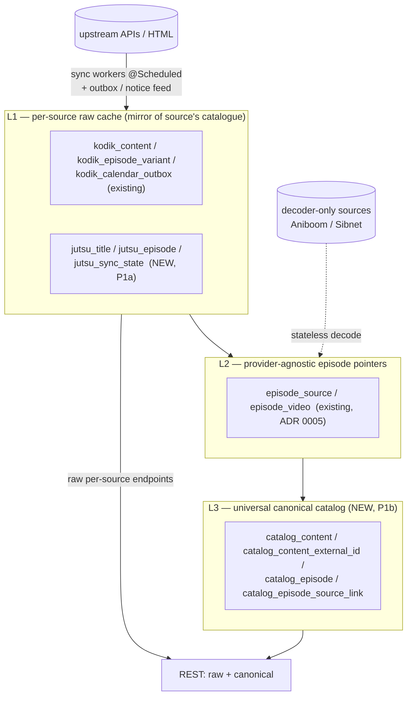
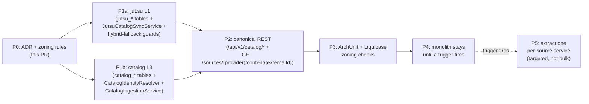

# ADR 0016 — Architecture trajectory: modular monolith now, per-source split on triggers

- **Status**: Accepted
- **Date**: 2026-05-07
- **Deciders**: orinuno maintainers
- **Related**: ADR 0001 (Kodik SDK extraction pilot), ADR 0012 (jut.su SDK extraction), ADR 0013 (Sibnet & Aniboom SDK extraction), ADR 0014 (controllers on SDK facades), ADR 0015 (jut.su full browser parity + drift), ADR 0005 (`episode_source`/`episode_video` provider-agnostic schema), [BACKLOG.md → IDEA-AP-1..4, IDEA-DRIFT-3, IDEA-SDK-SPLIT](../../BACKLOG.md), [TECH_DEBT.md](../../TECH_DEBT.md)

## Context

After ADR 0015 orinuno reached a stable state with four SDK modules (`kodik-sdk-drift`, `jutsu-sdk`, `sibnet-sdk`, `aniboom-sdk`) plus a single Spring Boot deployable (`orinuno-app`) that owns the database, REST API, scheduled jobs, and all cross-source orchestration. The natural next question is **whether to keep evolving as one process or split into per-source services with their own DB and an aggregator on top**.

Three forces push the question into the open right now:

1. **More sources are coming.** IDEA-AP-1 (Aniboom catalog), IDEA-AP-3 (Shikimori), IDEA-AP-4 (Sibnet ~5k+ titles) are all queued. If the answer is "split", the cost compounds with every new source we add inside the monolith.
2. **The SaaS scenario is two-canon.** kodik-parser in downstream-repo pulls **raw per-source** data from orinuno (`/api/v1/parse/requests`, `/api/v1/export/ready`, `/api/v1/kodik/list`) and feeds it into `meter`, which already owns the universal canonical catalog (`catalog_content` + identity resolution by kinopoisk → imdb → shikimori → mdl → tmdb → (sourceType, sourceId), see [`meter/docs/content-export.md`](../../../downstream-repo/meter/docs/content-export.md) and [`CatalogContentFindOrCreateService`](../../../downstream-repo/meter/src/main/java/com/corporate/meter/service/CatalogContentFindOrCreateService.java)). orinuno's own canonical catalog (if we add one) is therefore for the **open-source consumer**, not for Kin.
3. **jut.su has a real cache problem today.** ADR 0015 added catalog/search/info/episode/notice browser parity on top of the SDK, but `/api/v1/sources/jutsu/*` still hits live HTML on every request — there is no L1 cache, no incremental sync, no fallback when drift fires. This forces the question of "do per-source services need persistence?" before we add Aniboom or Sibnet.

The reference projects (kodik-api-rust, kodikwrapper, AnimeParsers, KodikDownloader) are all libraries or single applications. None of them split into per-source services with an aggregator. AnimeParsers is the closest multi-source analog and its model is "several clients in one pip package; the caller picks the source". That's strong market evidence that the open-source audience expects "simple to deploy" over "distributed by design".

## Decision

Adopt **Layout A — modular monolith with a universal canonical catalog as a separate bounded context inside `orinuno-app`**. Do **not** split into per-source services right now. Encode the trigger conditions for the future split (Layout B) explicitly so a later "let's distribute it" suggestion has to satisfy at least one of them.

The decision rests on three observations: SDK modules are already extracted (60–70% of any future split), `episode_source`/`episode_video` are already provider-agnostic, and the SaaS consumer (kodik-parser) needs a **stable raw per-source contract**, not a canonical one. The split-now alternative would deliver zero value to current consumers (kodik-parser does not benefit) and pay a 5×ops cost for an open-source-only canonical layer. The stateless-gateway alternative would discard `orinuno_parse_request` and the universal catalog premise, which contradicts the project's positioning as a multi-vertical platform.

### Source classification: catalog sources vs decoder sources

Not every source needs its own L1 tables. Sources fall into two classes by their nature, and this is the **canonical criterion** for adding a new source:

| Source | Class | L1 tables | Reason |
|---|---|---|---|
| **Kodik** | catalog (REST API ~150k titles) | yes, **already exist**: `kodik_content`, `kodik_episode_variant`, `kodik_calendar_state/outbox`, `kodik_decoder_path_cache`, `kodik_content_enrichment` | upstream returns structured metadata with external IDs |
| **jut.su** | catalog (HTML scraping ~5k anime) | yes, **to be added in P1a**: `jutsu_title`, `jutsu_episode`, `jutsu_translation` (optional), `jutsu_sync_state` | catalog is currently fetched live on every request; HTML parsing is slow and drift-prone |
| **Aniboom** | decoder (CDN/player; embed URL → mp4) | no, **stateless** | source has no concept of "title list"; `AniboomClient.decode(embedUrl)` is the entire surface |
| **Sibnet** | decoder (video host) | no, **stateless** | same; `SibnetClient.decode(...)` is the entire surface |

Adding-a-new-source rule (record this in `AGENTS.md`):

> "Does this source expose a list of titles?" → catalog source → add an L1 schema.
> "Does this source take a URL and return mp4?" → decoder source → keep it stateless behind the SDK facade.

A catalog source that is **also** a decoder (Kodik, future Sibnet-with-album-listing) gets both: L1 catalog tables for the title metadata + the decoder pipeline for video extraction.

### Three-layer data model

Why three layers and not two:

- **L1 vs L3 separation**: when jut.su's HTML drifts and the parser breaks, `jutsu_title` continues to serve `/api/v1/sources/jutsu/catalog` from the DB — sync stalls but reads stay alive. Identity resolution (L1 → L3) is a separate concern (fuzzy matching, Shikimori binding) and must not block ingestion. If the identity resolver has a bug, we can rebuild L3 from L1 without losing upstream data.
- **L2 stays as it is** (ADR 0005). It's the existing pointer layer between "this source has a video for this episode" and "this is the decoded mp4 with TTL".

### New bounded context: `catalog`

A new package `com.orinuno.catalog` inside `orinuno-app` owns L3. It exposes a `CatalogPublicApi` interface to other contexts (`kodik`, `jutsu`, future `sibnet`/`aniboom`) for `findOrCreateContent(...)` and `attachExternalId(...)`. Internals stay package-local.

**New L1 tables for jut.su (P1a)** in a dedicated changelog `com/orinuno/db/changelog/jutsu/` (separate include block in `liquibase-changelog.yaml`):

- `jutsu_title` — `slug` PK, `title_ru`, `title_en`, `status` (`ongoing` / `released`), `year`, `episodes_total`, `shikimori_id` (nullable, parsed from HTML), `mal_id` (nullable), `description`, `poster_url`, `last_synced_at`, `source_etag` (for conditional GET).
- `jutsu_episode` — `(title_slug, season, episode)` PK, `embed_url`, `video_qualities` (JSON: `{"480":..., "720":..., "1080":...}`), `last_synced_at`.
- `jutsu_translation` — optional, only if jut.su starts exposing duplicate entries with different dubs.
- `jutsu_sync_state` — singleton row: `last_full_crawl_at`, `last_notice_cursor`, `notice_walk_in_progress`.

**New L3 tables (P1b)** in a dedicated changelog `com/orinuno/db/changelog/catalog/`:

- `catalog_content` — universal canonical record (films, series, anime). Identity columns: `kinopoisk_id`, `imdb_id`, `shikimori_id`, `mal_id`, `mdl_id`, `tmdb_id` (all nullable). `title_ru`, `title_en`, `kind` (`movie`/`series`/`anime`), `year`, `created_at`, `updated_at`.
- `catalog_content_external_id` — normalized table `(source_type, external_id, content_id)` with unique index on `(source_type, external_id)` for O(1) lookup.
- `catalog_episode` — canonical episode `(content_id, season, episode)` referencing `catalog_content`.
- `catalog_episode_source_link` — M:N link between canonical episode and per-source `episode_source` rows (so multiple sources can be attached to the same canonical episode).

**`CatalogIdentityResolver`** (new) — analogue of meter's `CatalogContentFindOrCreateService` but without Kin business logic: `findOrCreate(sourceType, sourceId, externalIds…)`. Lookup order: `shikimori → mal → imdb → kinopoisk → mdl → tmdb → (sourceType, sourceId)`.

**`CatalogIngestionService`** (new) — sink invoked synchronously from the kodik / jut.su contexts when a row is upserted. No Rabbit / Kafka in P1: same transaction, same process. If async becomes necessary later, we move to an outbox pattern (already pattern-proven by `kodik_calendar_outbox`).

### Catalog sync workers as a first-class subsystem

L1 tables are useless without background sync against upstream. Each catalog source gets a sync worker; decoder sources do not.

- **Kodik** — already partially exists as `KodikDumpService` + `kodik_calendar_state`/`kodik_calendar_outbox` (CAL-6). In P1 formalize the contract as `KodikCatalogSyncService`: full crawl through public dumps + incremental through calendar outbox. No data migration, just a name + Javadoc that describes the L1-sync contract.
- **jut.su (NEW)** — `JutsuCatalogSyncService`:
  - **Full crawl** through `JutsuClient.browseCatalog()` once every 24–72h (`@Scheduled`, configurable). Upsert into `jutsu_title` + `jutsu_episode`.
  - **Incremental** through `JutsuClient.streamNoticeEntries()` / `walkNoticeFeedsBackwards()` (already in the SDK from ADR 0015). Cursor lives in `jutsu_sync_state.last_notice_cursor`. If the notice feed itself drifts, fall back to the next full crawl.
  - Each title upsert calls `CatalogIdentityResolver.findOrCreate(JUTSU, slug, shikimoriId?, malId?)` synchronously and writes the binding into `catalog_content_external_id`.
- **Aniboom / Sibnet** — no workers. Decoder sources stay stateless behind their SDK.

**Critical rule** — the sync worker **must never block REST reads**. If the worker stalls (drift, network outage, upstream 5xx), REST endpoints serve stale data with an `X-Sync-Stale-Seconds: <N>` header (mirrors the existing `Warning: 199` pattern from `KodikListController` for drift signalling).

### REST cutover for jut.su: hybrid-fallback with mandatory guards

Once `jutsu_title` / `jutsu_episode` exist, `/api/v1/sources/jutsu/*` (catalog, search, anime/{slug}, episode) changes its behaviour:

- **Cache hit (default path)** — answer is built from the DB, no upstream call. Header `X-Sync-Stale-Seconds: <last_synced_at - now>` if sync has stalled.
- **Cache miss** (slug missing from `jutsu_title`) — inline fallback to `JutsuClient` SDK, result is **synchronously upserted** into `jutsu_title`. This gives a friendly UX (the user doesn't have to wait for the next scheduled crawl) **but requires mandatory protection against the DDoS vector**:
  - **Rate limit** — Bucket4j, per `X-API-KEY` (or per remote IP if no key), default `1 req / 5 s`, configurable. Exceeding → `429 Too Many Requests`.
  - **Negative cache** — Caffeine in-memory, TTL 24h, key = slug. If upstream returns 404 / parser fails to find the title, slug goes into the negative cache and subsequent miss-requests on it **do not hit upstream** until TTL expires. This closes "iterate over non-existent slugs" attack.
  - **Kill-switch** — property `orinuno.jutsu.live-fallback.enabled` (default `true` in dev, `false` in prod). When disabled, cache miss returns `404` without touching upstream.
  - **Metrics** — `jutsu_live_fallback_total{outcome=hit|miss|rate_limited|disabled|negative_cache}`, exposed via `/actuator/prometheus`.
  - **Force-refresh for admin/debug** — `?refresh=true` skips the DB and forces an SDK call. Same rate limit applies, plus a non-anonymous `X-API-KEY` is required even in dev.

These guards are **acceptance criteria** for P1a — without them hybrid-fallback does not ship.

### REST contract surface: raw per-source vs canonical

orinuno splits its REST surface into two contract groups (this is already almost the shape today; ADR 0016 makes it explicit and stable):

#### Raw per-source — stable contract for downstream-repo/kodik-parser and any external consumer that wants source-level access

| Endpoint | Status | Audit notes |
|---|---|---|
| `POST /api/v1/parse/search` | stable | sync search; ParseController |
| `POST /api/v1/parse/requests` | stable | async submit; idempotent SHA-256 |
| `GET /api/v1/parse/requests/{id}` | stable | status; phase; progress |
| `GET /api/v1/parse/requests` | stable (limit=0 + `X-Total-Count` for backpressure only) | per `AGENTS.md` no-polling rule |
| `POST /api/v1/parse/decode/{contentId}` | stable | bulk decode |
| `POST /api/v1/parse/decode/variant/{variantId}` | stable | single variant |
| `GET /api/v1/export/{contentId}` | stable | per-content export |
| `GET /api/v1/export/ready` | stable | `?updatedSince=...` watermark for kodik-parser |
| `GET /api/v1/kodik/list` | stable | proxy with `Warning: 199` on drift |
| `GET /api/v1/embed/{idType}/{id}` | stable | shortcut to Kodik `/get-player`; idempotent; no DB write |
| `GET /api/v1/calendar` | stable | with `?enrich=true` |
| `GET /api/v1/calendar/outbox` | stable | watermark feed |
| `POST /api/v1/sources/{provider}/decode` | stable | stateless decode for kodik/sibnet/aniboom/jutsu |
| `GET /api/v1/sources/jutsu/{catalog,search,anime/{slug},episode,notice,notice/stream,drift}` | stable, gains DB-backed reads in P1a | hybrid-fallback rules above |
| `GET /api/v1/sources/jutsu/stream` | stable | CDN proxy (canonical path) |
| `GET /api/v1/sources` | stable | capabilities |
| `GET /api/v1/reference/{translations,genres,countries,years,qualities}` | stable | Caffeine-cached |
| `GET /api/v1/anime/{contentId}/episodes/{season}/{episode}/sources` | stable | `MultiSourceRanker` |
| `GET /api/v1/health/{integration,decoder,schema-drift,tokens,dumps,decoder/path-cache,proxy}` | stable | observability |

We promise backward compatibility on these endpoints because kodik-parser depends on them. Any change goes through OpenAPI snapshot diff (`docs-site/openapi.json`) before merge.

**New raw endpoint planned in P2** — `GET /api/v1/sources/{provider}/content/{externalId}` to give consumers a uniform "fetch by source's external id" path (currently you have to know that Kodik uses `/api/v1/embed/{idType}/{id}` and jut.su uses `/api/v1/sources/jutsu/anime/{slug}`).

#### Canonical — new in P2, for open-source consumers who want a single catalog entry point

- `GET /api/v1/catalog/content` — list with filters (`kind`, `year`, `external_id`, paging).
- `GET /api/v1/catalog/content/{id}` — single canonical record with all attached external IDs.
- `GET /api/v1/catalog/content/{id}/episodes` — canonical episode tree.
- `GET /api/v1/catalog/content/{id}/sources` — every source available for the canonical title (supersets the per-episode `MultiSourceController` for the "show me everything we have" use case).

The canonical surface is **not** consumed by kodik-parser. It is for open-source-aggregator consumers (Telegram bots, alternative front-ends, third-party indexers).

### Boundary discipline (zoning rules — keep the split-cost low)

These are the cheap discipline rules that turn a future split into a refactor instead of a rewrite. Enforced by ArchUnit + a Liquibase guard test in P3:

1. **Bounded contexts**: `kodik`, `jutsu`, `aniboom`, `sibnet`, `catalog`, `core` (the cross-cutting context that owns `orinuno_parse_request` and provider-agnostic `episode_source`/`episode_video`).
2. **No cross-context `@Autowired`** of internal classes. Each context exposes a single `*PublicApi` interface (e.g. `CatalogPublicApi`, `KodikPublicApi`); everything else is package-local. Enforced by an ArchUnit test.
3. **No cross-context FOREIGN KEYs in the DB**. Soft references (column with the other context's PK value, no `FOREIGN KEY` constraint). Enforced by a Liquibase parsing guard test that reads each `*.sql` and asserts no FK targets a table outside the context's directory.
4. **Each context owns its Liquibase changelog directory** (`com/orinuno/db/changelog/{kodik,jutsu,catalog,core}/`). `liquibase-changelog.yaml` aggregates them with explicit `<include>` per context.
5. **SDK external contract is stable**. Each SDK's facade (`KodikApiClient`, `JutsuClient`, `SibnetClient`, `AniboomClient`) + result records are the only types crossing the SDK boundary. When we ever do split, these are the wire types.
6. **`orinuno_parse_request` lives in `core`** because it is genuinely cross-source. When the split happens, it becomes a separate `orchestrator` service; everyone else stays a thin consumer.

### What does NOT change

- Maven structure (4 SDK modules + `orinuno-app`).
- `MultiSourceRanker` ([`orinuno-app/src/main/java/com/orinuno/service/orchestration/MultiSourceRanker.java`](../../orinuno-app/src/main/java/com/orinuno/service/orchestration/MultiSourceRanker.java)) — works at the canonical-episode level and fits neatly into the new `catalog` context.
- No Rabbit / Kafka. Canonical sink is synchronous, in the same transaction as the source upsert. If async becomes necessary, we use the outbox pattern already proven by `kodik_calendar_outbox`.
- downstream-repo / kodik-parser untouched. All its calls (`/api/v1/parse/requests`, `/api/v1/export/ready`, `/api/v1/kodik/list`) keep their current contract.

## Triggers for moving to Layout B (per-source split)

Recorded explicitly so that any future "let's break it apart" suggestion has to satisfy at least one of these. Without a trigger, we do not split.

1. **Independent scaling** — one source consistently consumes > 50% CPU/RAM of `orinuno-app` for longer than 30 days. Action: lift that source into its own deploy.
2. **Failure isolation** — one source causes ≥ 0.5% / month of downtime for unrelated endpoints (shared thread pool, shared DB connections, shared rate-limit interaction).
3. **Standalone product** — a commercial request for "sell only the Kodik parser" or "give us jut.su without Kodik" — wrap the bounded context as a standalone deploy.
4. **Multi-tenant SaaS** — a requirement for per-tenant isolation at the schema/DB level (today's row-level isolation insufficient).

The expected first trigger, if any, is (1) or (2) for jut.su — HTML scraping is the most resource-hungry path. The first split would lift `jutsu` out, leaving Kodik + decoders + catalog in `orinuno-app`.

## Considered alternatives

### Layout B — split now (4 source services + 1 aggregator)

Cost: 5 docker containers, 4–5 databases, inter-service contract with versioning, separate Liquibase per service, distributed tracing, per-service DR strategy, and a developer experience where "run orinuno locally" means "run docker compose with 6 services". Value to current consumers: zero — kodik-parser does not benefit (it consumes raw per-source, which is exactly what this monolith already provides), and the open-source consumer loses the simplicity that makes the project competitive against AnimeParsers.

**Rejected**: no triggers exist today; cost is real, value is hypothetical.

### Layout C — stateless gateway

Make `orinuno-app` stateless by pushing all persistence (parse-request queue, canonical catalog, drift history) to consumers. Value: minimum ops surface. Cost: gives up the universal canonical catalog premise, abandons `orinuno_parse_request` (or hands it to meter), and contradicts orinuno's positioning as a multi-vertical platform for open-source.

**Rejected**: contradicts the project's stated positioning. The parse-request queue exists exactly because Kodik decoding is long-running and must not be a synchronous HTTP call.

## Known tech debt (recorded here, not fixed in this ADR)

### `kodik_episode_variant` is an L1+L2 hybrid

The table currently stores both:

- `kodik_link` — raw URL from upstream (L1 semantics: mirror of what Kodik returned).
- `mp4_link` + `mp4_link_decoded_at` + `mp4_link_failed_count` + `decode_method` — decoded URL with TTL and decode bookkeeping (L2 semantics: same problem space as `episode_video.video_url` for non-Kodik sources).

Clean separation would require migrating the L2 columns out of `kodik_episode_variant` into `episode_video` (with `source_type=KODIK`). This is **deferred to P5 (split trigger)**: while we run as a monolith the hybrid causes no operational harm, but it does complicate a hypothetical Kodik-service extraction. Recorded in [`TECH_DEBT.md`](../../TECH_DEBT.md) with a back-link to this ADR.

## Roadmap

P1a and P1b are independent and can land in parallel (different PRs). Recommended merge order: P1a first (gives immediate value — jut.su REST stops burning upstream on every request), then P1b (gives open-source consumers a single canonical entry point).

## Blocked on

Nothing — this ADR fixes direction. Code work (`catalog_*` migrations, `CatalogIdentityResolver`, `JutsuCatalogSyncService`, hybrid-fallback guards, ArchUnit rules) lands as separate PRs against the roadmap above.

## Tracker

| Item | Status |
|------|--------|
| ADR 0016 + index update | ✅ this PR |
| `AGENTS.md` "Bounded contexts" section | ✅ this PR |
| `BACKLOG.md` P1/P2/P3 entries | ✅ this PR |
| `TECH_DEBT.md` kodik L1+L2 hybrid entry | ✅ this PR |
| P1a — `jutsu_title` / `jutsu_episode` / `jutsu_sync_state` migrations + repo | ⏳ pending |
| P1a — `JutsuCatalogSyncService` (full + incremental) | ⏳ pending |
| P1a — hybrid-fallback guards (rate limit + negative cache + kill-switch + metrics) | ⏳ pending |
| P1a — `JutsuApiController` cutover to DB-first reads | ⏳ pending |
| P1b — `catalog_content` / `catalog_content_external_id` / `catalog_episode` / `catalog_episode_source_link` migrations | ⏳ pending |
| P1b — `CatalogIdentityResolver` + tests | ⏳ pending |
| P1b — `CatalogIngestionService` + sync hooks from Kodik / jut.su contexts | ⏳ pending |
| P2 — `/api/v1/catalog/*` controller + DTOs | ⏳ pending |
| P2 — `GET /api/v1/sources/{provider}/content/{externalId}` unified raw lookup | ⏳ pending |
| P3 — ArchUnit "no cross-context @Autowired except *PublicApi" test | ⏳ pending |
| P3 — Liquibase guard "no cross-context FK" test | ⏳ pending |
