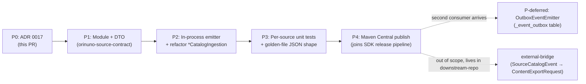

# ADR 0017 — `orinuno-source-contract`: producer-side event contract as a first-class Maven artifact

- **Status**: Accepted
- **Date**: 2026-05-10
- **Deciders**: orinuno maintainers
- **Related**: ADR 0001 (Kodik SDK extraction pilot), ADR 0012/0013 (per-source SDK extraction), ADR 0014 (controllers on SDK facades), ADR 0016 (architecture trajectory: modular monolith now, per-source split on triggers), [BACKLOG.md → ARCH-0017](../../BACKLOG.md), [TECH_DEBT.md](../../TECH_DEBT.md), and (out-of-tree) [`downstream-repo/meter-api-spring-boot-starter`](../../../downstream-repo/meter-api-spring-boot-starter), [`downstream-repo/kodik-parser`](../../../downstream-repo/kodik-parser).

## Context

ADR 0016 chose Layout A — modular monolith with bounded contexts inside `orinuno-app`, splitting into per-source services only when explicit triggers fire. Two dependent observations make the producer-side boundary worth promoting to a separate artifact **right now**, even though we haven't (and shouldn't) split:

1. **The L1 → L3 hand-off is currently typed in catalog-internal terms.** [`KodikCatalogIngestion`](../../orinuno-app/src/main/java/com/orinuno/service/KodikCatalogIngestion.java) and [`JutsuCatalogIngestion`](../../orinuno-app/src/main/java/com/orinuno/jutsu/sync/JutsuCatalogIngestion.java) translate L1 entities (`KodikContent`, `JutsuTitle`) directly into [`CatalogIdentityRequest`](../../orinuno-app/src/main/java/com/orinuno/catalog/api/CatalogIdentityRequest.java) and call [`CatalogPublicApi`](../../orinuno-app/src/main/java/com/orinuno/catalog/api/CatalogPublicApi.java) inside the same process. That's fine for in-process use, but it's the **wrong shape** for two foreseeable consumers:
   - Kin's `meter` (private). Today the chain is `orinuno-app → kodik-parser → meter` with kodik-parser translating orinuno's per-source DTOs into meter's `ContentExportRequest`. If we promote a stable producer-side event, kodik-parser shrinks to a thin adapter or disappears.
   - Future open-source aggregators (Telegram bots, indexers, alternative front-ends) that want to consume orinuno's source events without depending on `orinuno-app`'s internal types.

2. **Meter already proved the shape works.** [`downstream-repo/meter-api-spring-boot-starter`](../../../downstream-repo/meter-api-spring-boot-starter/src/main/java/com/corporate/meterapi/dto/) ships a sealed `ContentExportRequest` with `ExportMovieRequest | ExportSerialRequest`, an `Identifier(sourceType, sourceId)`, a `ContentCommonInfo` carrying external ids and chrome, and `Season → Episode → EpisodeVariant`. ~80% of the shape is reusable. The Kin-coupled bits are concentrated in well-defined hot spots (closed `SourceType` enum, `KinopoiskId`/`ImdbId`/… value-object wrappers, `VideoQuality`/`AudioQuality`/`AgeRestriction`/`StreamQuality` enums, `filepath` semantics) — they can be replaced with open strings + a `ExternalIds` record + `mediaUrl` rename.

The decision rests on: SDKs are already extracted (60–70% of any future split), L1 schemas are already in their own changelog directories with no cross-context FKs, and `episode_source`/`episode_video` is provider-agnostic. The producer-side event contract is the last remaining piece that has no first-class artifact, and promoting it now is the smallest possible move that delivers all three forces (Kin reuse / OSS ecosystem / future-split optionality).

## Decision

Add **`orinuno-source-contract`** as a sibling Maven module to the existing SDKs (`kodik-sdk-drift`, `jutsu-sdk`, `sibnet-sdk`, `aniboom-sdk`). It carries pure DTOs, no Spring, no Kin types, MIT/Apache, ready to publish to Maven Central alongside the SDKs.

Rewrite the L1 → L3 hand-off inside `orinuno-app` so that source contexts emit a `SourceCatalogEvent` to a `SourceEventEmitter`, and the catalog context provides the default in-process emitter (`CatalogSinkEventEmitter`) that translates the event into the existing `CatalogIdentityRequest` and calls `CatalogPublicApi.findOrCreateContent(...)`. **Behaviour stays identical**; the boundary becomes explicit and the event becomes the only thing crossing it.

Update ADR 0016 §"Boundary discipline" with one new rule: *"**Producer-side event contract is stable.** The only types crossing the source-context → consumer boundary are `SourceCatalogEvent` and the records it transitively references. Internal entities (`KodikContent`, `JutsuTitle`, …) are package-local."* This is the sibling of rule #5 ("SDK external contract is stable") and shares the same enforcement plan (ArchUnit, P3).

### What's in `orinuno-source-contract`

```
com.orinuno.contract.source/
├── SourceIdentifier            (record: open-string sourceType + sourceId)
├── ExternalIds                 (record: kinopoisk/imdb/shikimori/mal/anidb/anilist/tmdb/mdl/worldart-* — all nullable Strings)
├── Provenance                  (record: sourceUrl, fetchedAt, sdkVersion, parserMode, schemaDriftFlags)
├── ContentKindHint             (enum: MOVIE | SERIES | ANIME | UNKNOWN)
├── SourceContentInfo           (record: titleRu, titleEn, year, kindHint, externalIds)
├── SourceSeason                (record: order, title, episodes)
├── SourceEpisode               (record: order, title, mediaUrl, variants)
├── SourceEpisodeVariant        (record: identifier, mediaUrl, title, streamQuality, duration)
├── SourceCatalogEvent          (sealed: TitleObserved | MovieDiscovered | SeriesDiscovered | EpisodesUpdated | SourceRemoved)
└── SourceEventEmitter          (interface: void emit(SourceCatalogEvent))
```

Dependencies: `jackson-annotations` (for `@JsonTypeInfo` / `@JsonSubTypes` on the sealed event), `jakarta.annotation-api` (for `@Nullable`), `lombok` (provided), JUnit + AssertJ + `jackson-databind` in test scope. **No Spring, no Spring Boot, no jsoup, no slf4j.**

### What changes inside `orinuno-app`

- New package `com.orinuno.catalog.ingestion`. Hosts `CatalogSinkEventEmitter implements SourceEventEmitter` — the **default** in-process emitter, registered as a `@Component`, depends on `CatalogPublicApi`.
- `KodikCatalogIngestion` now depends on `SourceEventEmitter` (constructor-injected) instead of `CatalogPublicApi`. Builds a `SourceCatalogEvent.TitleObserved` from `KodikContent` and hands it to the emitter. Static helpers `mapKind(...)` / `resolveSourceId(...)` move into the emitter (they translate "this is what the source observed" into "this is what the resolver expects"); the ingestion class becomes a thin shim over the emitter.
- `JutsuCatalogIngestion` mirrors the same shape for `JutsuTitle`. `parseYear(...)` likewise relocates into the emitter.
- Existing kill-switches (`orinuno.kodik.catalog-ingestion.enabled`, `orinuno.providers.jutsu.sync.catalog-ingestion.enabled`) stay where they are; they gate the emit, not the sink. Behaviour with both flags off is byte-identical to today.

### Audit table — meter contract → orinuno-source-contract

| Meter type / field | Kin coupling | Replacement in orinuno-source-contract |
|---|---|---|
| [`Identifier.sourceType: SourceType`](../../../downstream-repo/meter-api-spring-boot-starter/src/main/java/com/corporate/meterapi/dto/Identifier.java) (closed enum: KODIK, upstream-source, ALLOHA, MANUAL, PROXY_SEASONVARS) | yes | open `String sourceType` on `SourceIdentifier`. Closed enums in shared artifacts force every new source into a coordinated release; an open string lets OSS consumers add `aniboom`, `sibnet`, `jutsu`, `shikimori` without recompiling the contract. |
| `ContentCommonInfo.{kinopoiskId, imdbId, shikimoriId, myDramaListId, tmdbId}` (each is `com.example.parser.common.model.<X>Id` wrapping `Optional<String>`) | yes | one `ExternalIds` record with plain `@Nullable String` fields. Adds `malId / anidbId / anilistId / worldartAnimationId / worldartCinemaId` that meter doesn't track but Kodik exposes (`worldart_link`) and AnimeParsers consumes. |
| `ContentCommonInfo.{videoQuality, audioQuality, ageRestriction}` (Kin enums) | yes | open `String` fields. Sources emit "1080p HD" / "16+" verbatim; consumers parse if they care. |
| `EpisodeVariant.streamQuality: StreamQuality` (Kin enum from `common.model.manual.source`) | yes | open `String streamQuality` on `SourceEpisodeVariant`. |
| `filepath` / `posterFilepath` / `bigPosterFilepath` / `previewImageFilepath` / `trailerFilepaths` (semantically MinIO object keys in Kin) | yes | rename to `mediaUrl` / `posterUrl` / `bigPosterUrl` / `previewImageUrl` / `trailerUrls`. Meaning becomes "fully-qualified URL". Meter's `external-bridge` (Kin-side adapter, lives in downstream-repo) re-interprets as a MinIO key on Kin's side. |
| `Season`, `Episode` records (modulo `filepath`) | no | copied verbatim with the rename. |
| Sealed `ContentExportRequest` with `ExportMovieRequest | ExportSerialRequest` deduction | no | adopted as `SourceCatalogEvent` shape. Adds `TitleObserved` (today's L1 → L3 hand-off without seasons/episodes — what `KodikCatalogIngestion` and `JutsuCatalogIngestion` actually emit), `EpisodesUpdated` (incremental refresh), `SourceRemoved` (upstream removal). |
| Builder/record/Lombok/Jackson `@JsonTypeInfo(DEDUCTION)` patterns | no | kept as-is — proven shape, no reason to invent something different. |
| (missing in meter) | n/a | new `Provenance` record on every event: `sourceUrl`, `fetchedAt`, `sdkVersion`, `parserMode` ("lenient" / "strict" for jut.su per ADR 0015), `schemaDriftFlags`. Meter ignores it; OSS L3 ingestion / drift dashboards persist it. |

### What does NOT change

- **Reactor structure.** Five SDK-style modules (now six with `orinuno-source-contract`) + `orinuno-app`. No restructure.
- **ADR 0016 trajectory.** Still Layout A. Triggers for Layout B (per-source split) are unchanged.
- **REST surface.** `/api/v1/parse/*`, `/api/v1/kodik/*`, `/api/v1/sources/jutsu/*`, `/api/v1/catalog/*` (P2) — none of these change. Producer-side events are an internal boundary, not a REST contract.
- **Kill-switches and behaviour with them off.** Default `false` for both `*-catalog-ingestion.enabled` flags stays. The new emitter is wired through dependency injection, so when the flag is off the emitter is never called.
- **`CatalogPublicApi` / `CatalogIdentityResolver`.** They keep their current API and remain the only types that touch `catalog_content` directly. The emitter is a translator into them, not a replacement.

### Async delivery (deferred to a follow-up)

ADR 0016 is explicit that synchronous, same-transaction writes are the rule — no Rabbit / Kafka. This ADR follows the same principle: the default emitter is `CatalogSinkEventEmitter` (synchronous, in-process). When the second consumer of `SourceCatalogEvent` shows up (Kin's `external-bridge` or a remote OSS aggregator), we'll add an opt-in `OutboxEventEmitter` selectable by `orinuno.source-events.delivery=in-process|outbox`, backed by a `<context>_event_outbox` table per source context, drained by an in-process worker for now. That step is recorded in the roadmap below as "P-deferred" and explicitly **does not ship in this ADR** — wiring it without a consumer is dead weight.

## Considered alternatives

### Define the contract inside `orinuno-app` (no new module)

Cost: the contract is then transitively coupled to Spring Boot's classpath. OSS consumers would have to depend on `orinuno-app` (a deployable, ~tens of MB transitive deps) to use the records. Defeats the "publishable to Maven Central" goal.

**Rejected.**

### Republish meter's `meter-api-spring-boot-starter` under an OSS license

Cost: the artifact carries Kin-specific types (`SourceType` closed enum, `KinopoiskId`/`ImdbId`/… value objects, `MANUAL` / `PROXY_SEASONVARS` source values, `BlockExportContent` semantics, `posterFilepath` interpreted as MinIO key) that orinuno doesn't want to expose to its OSS consumers. Forking-and-cleaning the artifact in-place inside downstream-repo would also bind orinuno's contract releases to downstream-repo's CI, which is the opposite of what we want.

**Rejected.** Instead: copy the *shape* (records, Builder pattern, `@JsonTypeInfo(DEDUCTION)` sealing) and rebuild the *types* in the orinuno repo. Kin's `external-bridge` (out of scope here) translates between the two.

### Define `SourceCatalogEvent` in a neutral repo (`orinuno-org/source-contract`)

Cost: extra repo, extra CI pipeline, extra release coordination, the contract has to evolve in lock-step with the SDK modules anyway because parsing changes (e.g. ADR 0015 jut.su parser modes feeding `Provenance.parserMode`) drive contract changes. Two repos, one source of truth — that's just a tax.

**Rejected** for the orinuno-repo location. Picked by the user explicitly: "live inside the orinuno repo".

## Roadmap



P1, P2, P3 land in this PR (or the next 1–2 sequential PRs against this ADR). P4 reuses the SDK publish pipeline (`IDEA-SDK-4`). P-deferred and the Kin bridge are gated behind their own consumers materialising — neither is part of this ADR's tracker.

## Blocked on

Nothing. Module + emitter + refactor are independent of P1a (jut.su L1) and P1b (catalog L3) — both already exist. ADR 0017 is purely about how source contexts hand events to consumers; it does not change schemas, REST contracts, or external behaviour.

## Tracker

| Item | Status |
|------|--------|
| ADR 0017 + index update | this PR |
| ADR 0016 boundary-discipline addendum (rule #7) | this PR |
| `BACKLOG.md` ARCH-0017 entry | this PR |
| `orinuno-source-contract` Maven module + DTOs + `SourceEventEmitter` interface | this PR |
| `CatalogSinkEventEmitter` (default in-process emitter) | this PR |
| `KodikCatalogIngestion` / `JutsuCatalogIngestion` refactor onto `SourceEventEmitter` | this PR |
| Adapt `KodikCatalogIngestionTest` / `JutsuCatalogIngestionTest` (mock emitter) | this PR |
| New `CatalogSinkEventEmitterTest` (mock `CatalogPublicApi`) | this PR |
| Golden-file JSON shape stability test inside `orinuno-source-contract` | this PR |
| `CatalogIngestionIT` stays green (Spring picks up the default emitter, behaviour unchanged) | this PR |
| Maven Central publish pipeline reuses `IDEA-SDK-4` plumbing | follow-up |
| `OutboxEventEmitter` + `<context>_event_outbox` table | deferred |
| `external-bridge` in `downstream-repo` (consumes `SourceCatalogEvent`, emits `ContentExportRequest`) | out of scope, follow-up in `downstream-repo` |
