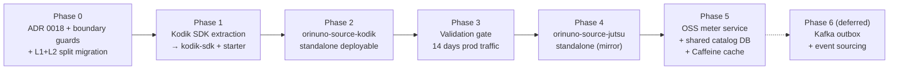

# ADR 0018 — Per-source service split: Kodik first

- **Status**: Accepted
- **Date**: 2026-05-11
- **Deciders**: orinuno maintainers
- **Related**: ADR 0001 (Kodik SDK extraction pilot), ADR 0005 (`episode_source`/`episode_video` provider-agnostic schema), ADR 0012/0013 (per-source SDK extraction), ADR 0014 (controllers on SDK facades), ADR 0015 (jut.su full browser parity), ADR 0016 (architecture trajectory: modular monolith now — **overridden by this ADR**), ADR 0017 (`orinuno-source-contract`), [BACKLOG.md](../../BACKLOG.md), [TECH_DEBT.md](../../TECH_DEBT.md).

## Context

ADR 0016 (2026-05-07) chose Layout A — modular monolith with bounded contexts inside `orinuno-app` — and recorded the explicit triggers that would justify moving to Layout B (per-source split). Four days later, four of those triggers fire simultaneously:

1. **Standalone product trigger** — we want independently deployable `orinuno-source-kodik` and `orinuno-source-jutsu` artefacts so that one source can be sold, integrated, or run without the other. ADR 0016 §"Triggers for moving to Layout B" item 3 fired.

2. **OSS ↔ corporate split (new trigger, not in ADR 0016)** — extract per-source parsers as **open-source services** to attract community contributions (drift fixes, new selectors, edge-case parsers) while keeping the rest of the corporate corporate pipeline (`downstream-repo/meter`, `kodik-parser`, frontend) private. This requires the parser to be a **first-class deployable** with its own repository, issue tracker, and release cadence — not an internal context inside a monolith. The "have your cake and eat it" — OSS surface for the parts of the codebase that are non-secret, corporate consumption via the existing `external-bridge`.

3. **Per-parser failure isolation** — current monolith share thread pools, DB connections, and rate-limit budgets across all sources. jut.su HTML drift / live-scrape pressure, Kodik API outages or token-rotation failures, future Aniboom catalog issues — any of them can bleed into the rest. ADR 0016 §"Triggers" item 2 fired; with two catalog sources active plus three more on the roadmap, this becomes a permanent operational concern.

4. **Preventive scaling for future sources** — IDEA-AP-1 (Aniboom catalog), IDEA-AP-3 (Shikimori), IDEA-AP-4 (Sibnet ~5k+ titles), plus any inbound community-contributed source — each new source compounds the monolith's surface area. Adding a new source as a standalone service is now cheaper than extending the monolith.

The market evidence from ADR 0016 §"Reference projects" (AnimeParsers, kodik-api-rust, kodikwrapper, KodikDownloader — none split) is still real, but it cuts the **opposite** way now: those projects are **single-source** libraries. orinuno's design point is multi-source, and the OSS-community-feedback flywheel needs per-source repositories to land contributions cleanly.

ADR 0017 (`orinuno-source-contract`) and the corresponding `external-bridge` (in `downstream-repo`, landed 2026-05-10) already turned the per-source → catalog hand-off into a stable contract. ~80% of the boundary discipline needed for the split is already paid. The remaining cost is mechanical: lift Kodik out of `orinuno-app` (it is the only source not yet fully extracted into an SDK — `client/`, `service/Kodik*`, `service/decoder/`, `token/` still live inside the deployable).

## Decision

Adopt **Layout B — per-source services + separate OSS `meter` + `orinuno` as multi-instance public-facing API gateway**, with the following invariants. **This ADR overrides §"Decision" of ADR 0016**.

### Target topology

Three tiers:

1. **Per-source services** (standalone deployables, OSS):
   - `orinuno-source-kodik` (Phase 2 of the split work)
   - `orinuno-source-jutsu` (Phase 4)
   - Each owns its L1 schema (`kodik_*` / `jutsu_*`), its own MySQL schema or database, its own REST surface (`/api/v1/kodik/*`, `/api/v1/sources/jutsu/*`, `/api/v1/parse/*` Kodik slice, etc.), and exposes `/api/v1/source-events/ready` emitting `SourceCatalogEvent` per ADR 0017.

2. **Two `meter`s — identical event contract, symmetric role, different ownership**:
   - `downstream-repo/meter` (proprietary, Kin) — already operational. Consumes events via `external-bridge` and lands `ContentExportRequest` into Kin's catalog (Kin DB). No change required by this ADR.
   - `meter` (NEW OSS service, Phase 5) — symmetric to Kin meter. Consumes the same `SourceCatalogEvent` from per-source services, runs identity resolution, writes L2/L3 (`episode_source`, `episode_video`, `catalog_*`) into a **shared catalog DB**.

3. **`orinuno` (NOT renamed)** — remains the public-facing API. Stateless relative to catalog. Read-only consumer of the shared catalog DB (via second MyBatis datasource + Caffeine cache). Reverse-proxies `/api/v1/kodik/*`, `/api/v1/sources/jutsu/*`, `/api/v1/parse/*` to the appropriate per-source service. Houses cross-source orchestration (`MultiSourceRanker`, source-registry endpoints, demo UI backing). Still embeds `sibnet-sdk` and `aniboom-sdk` as stateless decoder libraries (ADR 0016 §"Source classification" rule unchanged — decoder-only sources do not get standalone services). **Deployable in multiple instances behind a load balancer.**

### Source classification — unchanged

ADR 0016 §"Source classification" rule survives verbatim:

| Source | Class | Treatment after split |
|---|---|---|
| Kodik | catalog (REST API ~150k titles) | **standalone service** (Phase 2) |
| jut.su | catalog (HTML scraping ~5k anime) | **standalone service** (Phase 4) |
| Aniboom | decoder (CDN/player) | **stays as library** inside `orinuno` |
| Sibnet | decoder (video host) | **stays as library** inside `orinuno` |
| Shikimori (future) | metadata index, not a video source (ADR 0007) | enrichment client inside `meter` |
| Future sources | rule: "Does this source expose a list of titles?" → standalone service. "Does it take a URL and return mp4?" → decoder library. | unchanged |

### Shared catalog DB pattern (meter writes, orinuno reads)

`meter` is the **single writer** of `catalog_*`, `episode_source`, `episode_video`. `orinuno` is **many-reader** of the same tables via a second MyBatis datasource (`spring.datasource.catalog.*`) and a Caffeine cache layer (TTL 5 min, SWR 1 min, max 50k entries).

Rationale (full discussion in §"Considered alternatives"):

- **No HTTP hop between `orinuno` and `meter`** — multi-instance `orinuno` does not turn `meter` into a critical-path service. `meter` may be down for hours; `orinuno` read path keeps serving cached and DB-resident data.
- **Symmetric to Kin meter pattern** — `downstream-repo/meter` also owns its catalog DB; the OSS topology mirrors the corporate one.
- **No second contract surface to maintain** — `SourceCatalogEvent` (already shipped) stays the only between-service contract. Catalog read access is intra-deployment (shared DB).
- **DB-level least privilege** — `meter_writer` MySQL user has DML grants on catalog tables; `orinuno_reader` has SELECT-only. Any accidental write attempt from `orinuno` fails at the DB driver.

Acknowledged trade-off: schema coupling between `meter` and `orinuno`. Migrations are owned by `meter` (Liquibase apply on `meter` startup); `orinuno` read mappers consume those tables and follow `meter`'s schema. Deploy order: `meter` up first, `orinuno` second. This is the standard cost of any shared-DB pattern; the **path forward** is recorded as a future ADR migrating to Kafka event sourcing (see §"Future evolution" below).

### Event contract — preserved verbatim from ADR 0017

`SourceCatalogEvent` + `SourceEventEmitter` interface + `orinuno-source-contract` Maven module — no shape changes. Per-source services emit; both `meter`s (Kin proprietary + OSS) consume identically via `*RemoteEventPoller` HTTP poll against `/api/v1/source-events/ready`. The artefact stays publishable to a local / internal Maven repo; **Maven Central is explicitly deferred** until an external consumer requests it (no value in publishing speculatively).

### REST surface stability

External URLs unchanged. `orinuno` reverse-proxies:

- `/api/v1/kodik/*` → `orinuno-source-kodik`
- `/api/v1/sources/jutsu/*` → `orinuno-source-jutsu`
- `/api/v1/parse/*` → `orinuno-source-kodik` (parse-request queue migrates with Kodik; future sources that need an async parse queue get their own slice)
- `/api/v1/calendar*`, `/api/v1/embed/*`, `/api/v1/download/*`, `/api/v1/hls/*`, `/api/v1/stream/*` → `orinuno-source-kodik`
- `/api/v1/catalog/*` → `orinuno` reads directly from shared catalog DB (NEW endpoint, Phase 5)
- `/api/v1/source-events/ready` → per-source service serves its own; consumed by both `meter`s

`kodik-parser` in `downstream-repo` keeps its current endpoint surface against `orinuno`; the reverse-proxy is invisible. Demo UI (`demo/`, port 3000) likewise unaffected.

### Bounded-context discipline → service boundary discipline

ADR 0016 §"Boundary discipline" rules survive but harden:

1. Bounded contexts (kodik, jutsu, aniboom, sibnet, catalog, core) → become **services or library boundaries**:
   - `orinuno-source-kodik`, `orinuno-source-jutsu` (services)
   - `kodik-sdk`, `jutsu-sdk`, `sibnet-sdk`, `aniboom-sdk` (libraries)
   - `meter` (service, owns catalog write-path)
   - `orinuno` (service, owns API gateway + cross-source orchestration + decoder libs)
   - `orinuno-source-contract` (library, the only cross-service typed contract)
2. **No cross-service Java imports** of internal classes. Only `orinuno-source-contract` types cross service boundaries.
3. **No cross-service FK in shared catalog DB** — already true (catalog tables are L3; L1 lives per-service). `meter` is the only writer; `orinuno` reads.
4. **Each service owns its Liquibase changelog directory.** Cross-service migrations forbidden.
5. **SDK external contracts are stable.** Each SDK facade + result records are the wire types; backwards-compatibility per SDK release.
6. **`orinuno_parse_request` migrates with Kodik** into `orinuno-source-kodik`. When a second source needs an async request queue, it gets its own.
7. **Producer-side event contract is stable** (ADR 0017 rule survives unchanged).

### Maven reactor changes

New modules (incremental):

- `kodik-sdk/` (Phase 1; symmetric to `jutsu-sdk`; absorbs `kodik-sdk-drift` into a single module)
- `kodik-sdk-spring-boot-starter/` (Phase 1)
- `orinuno-source-kodik/` (Phase 2 — standalone deployable)
- `orinuno-source-jutsu/` (Phase 4 — standalone deployable)
- `meter/` (Phase 5 — NEW OSS meter service)

`orinuno-app/` is **not renamed**. It loses Kodik internals (Phase 1–2), jut.su internals (Phase 4), and catalog write-path (Phase 5); it gains read-only catalog access + Caffeine cache (Phase 5).

A **`-P monolith` Maven profile** is preserved throughout: it builds `orinuno` + `meter` + per-source services into a single fat jar with an embedded MySQL/H2 for contributor local-dev. This is critical for OSS adoption — ADR 0016's "Reference projects" argument (don't punish casual contributors with 5+ docker containers) remains valid even after the split.

### Future evolution — Kafka event-sourcing (recorded as future ADR)

The shared catalog DB pattern is explicitly **interim**. A future ADR will migrate `orinuno` read-path off the shared DB onto Kafka-delivered `CatalogChangeEvent`s emitted by `meter` via the transactional outbox pattern (symmetric to ADR 0017 §"Async delivery" for source services). Triggers for that follow-up ADR:

1. `meter` schema refactors break `orinuno` read-mappers ≥3 times per quarter.
2. Multi-DC or read-locality requirements appear.
3. Caffeine cache hit-rate <80% under prod load, or MySQL connection pool starvation observed.
4. A third non-`orinuno` consumer (Telegram bot, search indexer) wants real-time catalog updates.

The migration is **non-breaking**: outbox table is added in a single migration, the orinuno consumer ships behind a `orinuno.catalog.source=shared-db|kafka` flag, cutover is per-deployment. Path forward is open without committing to Kafka in the OSS minimum docker-compose right now.

## Considered alternatives

### Layout A — stay monolith (ADR 0016 §"Decision")

**Rejected.** Four triggers from ADR 0016's own list fire simultaneously (standalone product, per-parser failure isolation, preventive scaling) plus the new OSS-community-feedback driver. The monolith has stopped being the cheaper option for the next year of work.

### Single OSS meter that *also* serves public API (drop `orinuno`, rename to `meter`)

**Rejected.** Conflates two roles: catalog collector (write-only batch process, internal-facing) and public-facing API (multi-instance, latency-sensitive, end-user). `orinuno` already handles cross-source orchestration (`MultiSourceRanker`, parse-request log, demo UI backing), reverse-proxies sources, and embeds the stateless decoder libs (Sibnet, Aniboom). Forcing the `meter` deployable to do both means it must scale on user traffic — exactly what we want to avoid (`meter` should be small, focused, and may run on a single instance).

### HTTP API between `orinuno` and `meter` (no shared DB)

**Rejected for now.** Clean schema decoupling, but two real costs:
- `meter` becomes a critical-path service for every cache-miss `/api/v1/catalog/*` request from any `orinuno` instance. With multi-instance `orinuno`, cache cold-start traffic concentrates on `meter`.
- Adds a second versioned API contract surface (`meter` REST + `SourceCatalogEvent`) to evolve in lock-step.

Shared DB + Caffeine cache delivers similar performance characteristics with one less moving part. The cost (schema coupling) is acknowledged and the upgrade path (Kafka event-sourcing) is recorded.

### Kafka outbox event sourcing now (Phase 6 brought forward)

**Rejected for the current scope.** Kafka in the minimum OSS docker-compose adds significant ops surface (broker, KRaft / Zookeeper, schema-registry pattern, consumer group offsets) — the same friction ADR 0016 cited as a deal-breaker for the OSS audience. The catalog changes slowly (Kodik dumps daily, jut.su incrementally hourly); shared DB + 5-min Caffeine TTL meets every latency and freshness requirement we have today. Path forward is preserved as a future ADR.

### Per-source split as Maven Spring Boot starters instead of standalone deployables

**Rejected.** Starters embed source logic into a host process; defeats the OSS-community-fork driver (a contributor cannot run `orinuno-source-kodik` standalone to validate a PR) and defeats failure isolation (a starter shares the JVM with `orinuno`). Standalone deployables + the `-P monolith` profile achieve both: prod gets isolation, dev gets convenience.

## Roadmap

This ADR carries the full phasing of the split. Each Phase ships as one or more PRs.

| Phase | Scope | Status |
|---|---|---|
| 0.1 | Refresh ADR 0016 + 0017 trackers | ✅ done |
| 0.2 | ADR 0018 (this ADR) + index update | ✅ done |
| 0.3 | ArchUnit + Liquibase boundary guards | ✅ done |
| 0.4 | `kodik_episode_variant` L1+L2 split (ADR 0016 §"Known tech debt" → unblocks Kodik extraction) | ✅ done |
| 1.* | Kodik SDK extraction into `kodik-sdk` (+ `kodik-sdk-spring-boot-starter`); absorb `kodik-sdk-drift` | ✅ done (Phases 1.1–1.4, 1.6, 1.8) |
| 2.* | `orinuno-source-kodik` standalone deployable; reverse-proxy in `orinuno`; external-bridge cutover; demo UI continues working unchanged | 🚧 in progress (2.1–2.4, 2.6, 2.8–2.11 ✅; 2.5 + 2.12 ⏳) |
| 3 | Validation gate (14 days prod stability of `orinuno-source-kodik`) | ⏳ pending |
| 4.* | `orinuno-source-jutsu` extraction (mirror of Phase 2) | ⏳ pending |
| 5.* | `meter` OSS service; catalog write-path moves into `meter`; `orinuno` read-only repository + Caffeine cache; multi-instance `orinuno`; DB user separation; full split docker-compose | 🚧 in progress (5.1, 5.2a, 5.3, 5.4, 5.5, 5.6, 5.7, 5.7a, 5.9, 5.11 ✅; 5.8 + 5.10 + 5.12 + 5.13 ⏳) |
| 6 | Kafka outbox + event sourcing (future ADR, triggered by §"Future evolution") | ⏳ deferred |

### Phase 2 migration recipe — Kin kodik-parser / external-bridge cutover

External consumers (Kin's `downstream-repo/kodik-parser`, `downstream-repo/external-bridge`) reach the Kodik routes via the `orinuno` reverse-proxy by default — no code change required when Phase 2.8's filter is enabled. To bypass the orinuno hop entirely and call `orinuno-source-kodik` directly:

- `downstream-repo/kodik-parser/src/main/resources/application.yml` — override `SOURCEKODIK_BASE_URL=http://orinuno-source-kodik:8086` (or whatever DNS name the deployer chose). Endpoint paths (`/api/v1/kodik/*`, `/api/v1/embed/*`, `/api/v1/reference/*`, `/api/v1/source-events/*`) are identical, so no client changes.
- `downstream-repo/external-bridge` — point its source-events poller at `http://orinuno-source-kodik:8086/api/v1/source-events/ready` instead of `http://orinuno:8085/...`. Watermark / payload shape identical.

The reverse-proxy stays as the durable fallback: consumers that keep pointing at `orinuno` continue to work unchanged. Direct routing is a perf/independence optimisation, not a correctness requirement.

## Blocked on

Nothing. Phase 0.3 (boundary guards) and Phase 0.4 (L1+L2 split migration) are non-blocking prerequisites that land before Phase 1 — they protect against drift while Kodik extraction is in flight.

## Tracker

| Item | Status |
|------|--------|
| ADR 0018 + index update | ✅ done |
| ADR 0016 successor section updated | ✅ Phase 0.1 (commit 47fc690) |
| ADR 0017 successor context added | ✅ Phase 0.1 (commit 47fc690) |
| Phase 0.3 ArchUnit + Liquibase guards | ✅ done |
| Phase 0.4 `kodik_episode_variant` L1+L2 split migration | ✅ done |
| Phase 1 `kodik-sdk` + starter | ✅ done |
| Phase 2 `orinuno-source-kodik` standalone | 🚧 in progress (2.1–2.4, 2.6, 2.8–2.11 ✅; 2.5 + 2.12 ⏳) |
| Phase 3 validation gate | ⏳ pending |
| Phase 4 `orinuno-source-jutsu` standalone | ⏳ pending |
| Phase 5 OSS `meter` service + shared catalog DB | 🚧 in progress (write-path moved into `meter`; multi-instance acceptance test + monolith profile reattach pending) |
| Phase 6 Kafka outbox (future ADR) | ⏳ deferred |
| `AGENTS.md` "Bounded contexts" → "Per-source service registry" update | ⏳ Phase 5 |
| `BACKLOG.md` entries for each Phase | ⏳ pending |
| `TECH_DEBT.md` — close kodik L1+L2 hybrid entry after Phase 0.4 | ⏳ Phase 0.4 |
